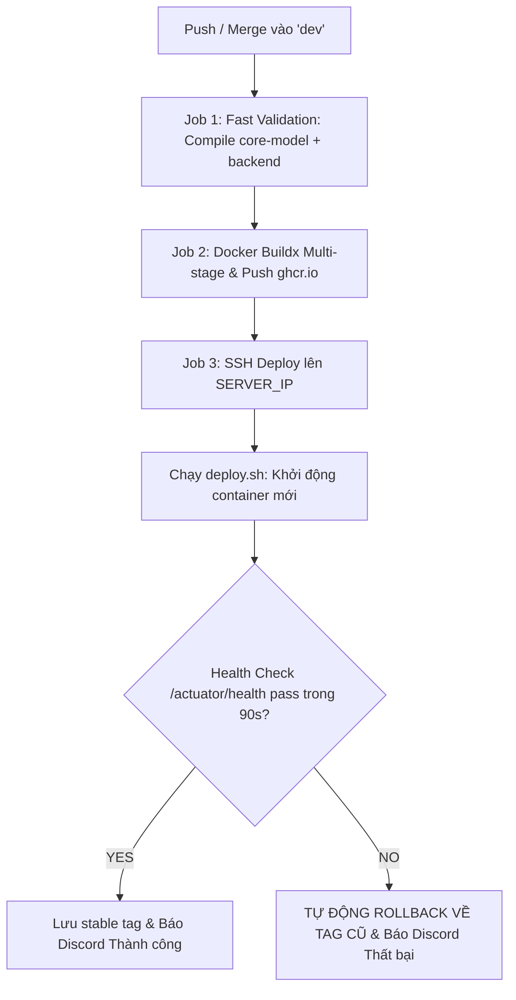

# ⚙️ ERP Backend Service (`backend-service`)
> **Dịch vụ RESTful API Trung tâm & Xử lý Nghiệp vụ Hệ sinh thái ERP Pine Drink (ERP-UTT)**

---

## 🧭 MỤC LỤC
1. [Project Overview (Tổng quan dự án)](#1-project-overview-tổng-quan-dự-án)
2. [Problem & Solution (Vấn đề & Giải pháp)](#2-problem--solution-vấn-đề--giải-pháp)
3. [Core Features (Tính năng cốt lõi)](#3-core-features-tính-năng-cốt-lõi)
4. [Business Flow (Luồng xử lý nghiệp vụ)](#4-business-flow-luồng-xử-lý-nghiệp-vụ)
5. [System Architecture (Kiến trúc hệ thống)](#5-system-architecture-kiến-trúc-hệ-thống)
6. [Tech Stack (Công nghệ sử dụng)](#6-tech-stack-công-nghệ-sử-dụng)
7. [Repository Structure (Cấu trúc thư mục)](#7-repository-structure-cấu-trúc-thư-mục)
8. [Getting Started (Bắt đầu nhanh)](#8-getting-started-bắt-đầu-nhanh)
9. [Configuration (Cấu hình hệ thống)](#9-configuration-cấu-hình-hệ-thống)
10. [API Documentation (Tài liệu API & Chuẩn giao tiếp)](#10-api-documentation-tài-liệu-api--chuẩn-giao-tiếp)
11. [Security (Bảo mật & Phân quyền RBAC)](#11-security-bảo-mật--phân-quyền-rbac)
12. [Database (Cơ sở dữ liệu & Quản lý Migration)](#12-database-cơ-sở-dữ-liệu--quản-lý-migration)
13. [Testing (Chiến lược kiểm thử)](#13-testing-chiến-lược-kiểm-thử)
14. [CI/CD (Tự động hóa CI/CD với GitHub Actions)](#14-cicd-tự-động-hóa-cicd-với-github-actions)
15. [Deployment (Triển khai & Vận hành Server)](#15-deployment-triển-khai--vận-hành-server)
16. [Monitoring (Giám sát, Metrics & Logging)](#16-monitoring-giám-sát-metrics--logging)
17. [Development / Contribution (Quy chuẩn phát triển & Đóng góp)](#17-development--contribution-quy-chuẩn-phát-triển--đóng-góp)
18. [Documentation (Tài liệu tham chiếu)](#18-documentation-tài-liệu-tham-chiếu)

---

## 1. Project Overview (Tổng quan dự án)

`backend-service` là **ứng dụng máy chủ trung tâm (Core RESTful API Service)** chịu trách nhiệm xử lý toàn bộ logic nghiệp vụ, quản lý giao dịch CSDL, phân quyền truy cập và bảo mật cho chuỗi F&B Pine Drink (ERP-UTT).

Hệ thống được xây dựng trên nền tảng **Java 21 LTS** và **Spring Boot 4.1.0**, kết hợp cơ sở dữ liệu **PostgreSQL 16**, bộ nhớ đệm phân tán **Redis 7** và thư viện lõi **`erp-core-model`**.

---

## 2. Problem & Solution (Vấn đề & Giải pháp)

### 2.1. Vấn đề thực tế (Problem)
* Chuỗi đồ uống F&B có lưu lượng truy cập lớn, yêu cầu xử lý giao dịch mua hàng (PO), xuất nhập tồn (INV) và bán hàng (POS) với độ trễ thấp và tính toàn vẹn cao.
* Cần kiểm soát chặt chẽ trạng thái đơn hàng (State Machine) để tránh sai sót công nợ và thất thoát nguyên vật liệu.
* Rủi ro bị tấn công vét cạn (Brute-force) hoặc nghẽn mạng do lạm dụng API.
* Mã nguồn phức tạp, khó gỡ lỗi nếu phụ thuộc vào các công cụ tự sinh code ma thuật (Lombok, MapStruct).

### 2.2. Giải pháp của Backend-Service (Solution)
* **Kiến trúc phân tầng sạch (Clean Layered Architecture):** Tách biệt Controller $\rightarrow$ Service $\rightarrow$ Repository $\rightarrow$ Mapper.
* **100% Không Lombok / Không MapStruct:** Viết tay Getters, Setters, Constructors và Mappers tường minh giúp nắm rõ 100% luồng dữ liệu, tăng tốc compile và loại bỏ lỗi ngầm.
* **Rate Limiting Đa tầng với Bucket4j & Redis:** Giới hạn lưu lượng theo IP và Token đăng nhập.
* **Xác thực Stateless JWT (JJWT 0.12.6):** Phân quyền ma trận RBAC theo Phạm vi (Scope: System / Branch / Department / Store).
* **Flat ID Linking:** Tự ghép nối dữ liệu trong tầng Service qua ID, tránh lỗi N+1 Query của JPA.

---

## 3. Core Features (Tính năng cốt lõi)

| Phân hệ | Tính năng | Mô tả |
| :--- | :--- | :--- |
| **Xác thực & RBAC** | `AuthController`, `RoleController` | Đăng nhập, cấp Access/Refresh Token, phân quyền động theo Role - Permission - Scope. |
| **Kiểm soát tải** | `RateLimitingFilter` | Bảo vệ API qua Redis Bucket4j (Anonymous: 20-200 req/phút, Authenticated: 100-1000 req/phút). |
| **Mua hàng (PROC)** | `SupplierService`, `PurchaseOrderService` | Quản lý hồ sơ NCC, Bảng giá NVL, Chu trình PO (DRAFT $\rightarrow$ SUBMITTED $\rightarrow$ APPROVED / REJECTED $\rightarrow$ CANCELLED). |
| **Kiểm toán dữ liệu** | `AuditService` | Ghi nhận nhật ký các thay đổi trọng yếu (Tạo đơn, duyệt đơn, sửa giá) vào `ia_audit_log`. |
| **Tài liệu hóa API** | SpringDoc OpenAPI | Tự động sinh Swagger UI và OpenAPI v3 Spec. |
| **Giám sát sức khỏe** | Spring Boot Actuator | Health probes (`/liveness`, `/readiness`), Prometheus metrics. |

---

## 4. Business Flow (Luồng xử lý nghiệp vụ)

### 4.1. Luồng Xử lý Một HTTP Request
```
[Client / Frontend]
        │
        ▼ HTTP Request kèm Bearer JWT Token
┌──────────────────────────────────────┐
│ 1. RateLimitingFilter (Bucket4j+Redis)│ ➔ Kiểm tra hạn ngạch Request/phút
└──────────────────┬───────────────────┘
                   │ Pass
                   ▼
┌──────────────────────────────────────┐
│ 2. JwtAuthenticationFilter (JJWT)    │ ➔ Giải mã token, nạp Authentication vào SecurityContext
└──────────────────┬───────────────────┘
                   │
                   ▼
┌──────────────────────────────────────┐
│ 3. RestController Layer              │ ➔ Kiểm tra @PreAuthorize("hasAuthority(...)")
└──────────────────┬───────────────────┘   Kiểm tra @Valid Request DTO
                   │
                   ▼
┌──────────────────────────────────────┐
│ 4. Service Layer (Business Logic)    │ ➔ Quản lý Transaction (@Transactional)
│    - Kiểm tra State Machine          │   Truy vấn & Ghép nối dữ liệu qua Flat ID
│    - Ghi nhận Audit Log              │
└──────────────────┬───────────────────┘
                   │
                   ▼
┌──────────────────────────────────────┐
│ 5. Manual Mapper & Repository        │ ➔ Chuyển đổi Entity ⇄ DTO qua Component viết tay
└──────────────────┬───────────────────┘   Truy vấn PostgreSQL 16
                   │
                   ▼
┌──────────────────────────────────────┐
│ 6. Response Envelope                 │ ➔ Trả về ResponseEntity<ApiResponse<T>>
└──────────────────────────────────────┘   (hoặc RFC 7807 ProblemDetail nếu có lỗi)
```

### 4.2. State Machine Quản lý Đơn Mua Hàng (PO Workflow)
```
          ┌─────────────┐
          │    DRAFT    │ ◄── [Tạo mới / Chỉnh sửa PO]
          └──────┬──────┘
                 │ Trình duyệt (submit)
                 ▼
          ┌─────────────┐
          │  SUBMITTED  │
          └──────┬──────┘
                 │
       ┌─────────┴─────────┐
       │ Phê duyệt         │ Từ chối
       ▼                   ▼
┌─────────────┐     ┌─────────────┐
│  APPROVED   │     │  REJECTED   │
└─────────────┘     └─────────────┘
       │
       ▼ Hủy đơn (cancel)
┌─────────────┐
│  CANCELLED  │
└─────────────┘
```

---

## 5. System Architecture (Kiến trúc hệ thống)

### 5.1. Sơ đồ Kiến trúc Tổng thể
```
                               [CLIENT / BROWSER]
                                       │
                                       │ HTTP / Port 80 (443)
                                       ▼
                       ┌───────────────────────────────┐
                       │      NGINX REVERSE PROXY      │
                       └───────────────┬───────────────┘
                                       │ Proxy Pass /api/v1/**
                                       ▼ Port 8080
┌─────────────────────────────────────────────────────────────────────────────┐
│ BACKEND SERVICE (Spring Boot 4 / Java 21)                                   │
│                                                                             │
│  ┌───────────────────────────────────────────────────────────────────────┐  │
│  │ Security & Filters: RateLimitingFilter, JwtAuthenticationFilter       │  │
│  └───────────────────────────────────┬───────────────────────────────────┘  │
│                                      ▼                                      │
│  ┌───────────────────────────────────────────────────────────────────────┐  │
│  │ Web Layer: Controllers (@RestController, @RequestMapping, @Valid)     │  │
│  └───────────────────────────────────┬───────────────────────────────────┘  │
│                                      ▼                                      │
│  ┌───────────────────────────────────────────────────────────────────────┐  │
│  │ Service Layer: Business Logic, State Machine, Transaction Management  │  │
│  └───────────────────┬───────────────────────────────────┬───────────────┘  │
│                      ▼                                   ▼                  │
│  ┌───────────────────────────────────────┐ ┌─────────────────────────────┐  │
│  │ Mappers: Manual @Component Mappers    │ │ Repositories: JpaRepository │  │
│  └───────────────────────────────────────┘ └─────────────┬───────────────┘  │
└──────────────────────────────────────────────────────────┼──────────────────┘
                                                           │
                                   ┌───────────────────────┴───────────────────────┐
                                   ▼                                               ▼
                        ┌─────────────────────┐                         ┌─────────────────────┐
                        │    PostgreSQL 16    │                         │       Redis 7       │
                        │    (Cơ sở dữ liệu)  │                         │    (Cache & Limiter)│
                        └─────────────────────┘                         └─────────────────────┘
```

### 5.2. Các Ràng buộc Kiến trúc Bắt buộc
1. **Tuyệt đối KHÔNG dùng Lombok:** Tự viết Getters, Setters, Constructors tường minh.
2. **Tuyệt đối KHÔNG dùng MapStruct:** Tự viết các class Mapper thủ công gắn `@Component`.
3. **Phản hồi chuẩn `ApiResponse<T>`:** 100% API trả về bọc qua Envelope chuẩn.
4. **Mã lỗi tập trung:** Mọi lỗi nghiệp vụ khai báo trong `com.erp.backend_service.exception.ErrorCode`.
5. **JavaDocs 100%:** Bắt buộc viết JavaDocs đầy đủ cho Controller, Service, Repository, Mapper.

---

## 6. Tech Stack (Công nghệ sử dụng)

* **Ngôn ngữ & Runtime:** Java 21 LTS.
* **Framework:** Spring Boot 4.1.0.
* **Bảo mật:** Spring Security, JJWT (io.jsonwebtoken) 0.12.6.
* **Cơ sở dữ liệu & ORM:** PostgreSQL 16, Spring Data JPA, Hibernate ORM 7.
* **Bộ nhớ đệm & Rate Limit:** Redis 7, Spring Data Redis, Bucket4j 8.10.1.
* **Quản lý DB Migration:** Liquibase.
* **Tài liệu API:** SpringDoc OpenAPI Starter WebMVC UI 3.1.0.
* **Giám sát:** Spring Boot Actuator, Micrometer Prometheus.
* **Kiểm thử:** JUnit 5, Mockito, Spring Security Test, Testcontainers PostgreSQL.
* **Containerization:** Docker Multi-stage Build.

---

## 7. Repository Structure (Cấu trúc thư mục)

```
backend-service/
├── pom.xml                                   # Cấu hình Maven Dependencies & Build
├── Dockerfile                                # Multi-stage Docker build tối ưu
├── deploy/                                   # Tài liệu & kịch bản triển khai Server
│   ├── DEPLOYMENT_GUIDE.md                   # Hướng dẫn vận hành CI/CD & Server
│   ├── PRODUCTION_OPERATIONS_MANUAL.md       # Sổ tay vận hành Production chi tiết
│   ├── server-setup.sh                       # Khởi tạo máy chủ ban đầu
│   └── scripts/
│       ├── 01-server-infra.sh                # Chạy PostgreSQL & Redis container
│       ├── deploy.sh                         # Triển khai tự động kèm Health Check
│       └── rollback.sh                       # Rollback tức thì về bản stable trước
├── src/
│   ├── main/
│   │   ├── docker/                           # Các tệp Docker Compose hạ tầng
│   │   │   ├── infra.yml                     # Compose chạy PostgreSQL 16 & Redis 7
│   │   │   ├── app.yml                       # Compose chạy backend-service
│   │   │   ├── postgresql.yml                # Cấu hình dịch vụ PostgreSQL
│   │   │   └── redis.yml                     # Cấu hình dịch vụ Redis
│   │   ├── java/com/erp/backend_service/
│   │   │   ├── BackendServiceApplication.java# Entrypoint khởi chạy Spring Boot
│   │   │   ├── configuration/                # Cấu hình Security, Redis, CORS, OpenAPI
│   │   │   ├── controller/                   # REST Controllers tiếp nhận request
│   │   │   ├── service/                      # Service Interfaces & Implementations
│   │   │   ├── repository/                   # Spring Data JPA Repositories
│   │   │   ├── mapper/                       # Hand-written Mappers (@Component)
│   │   │   ├── security/                     # JwtUtils, UserDetailsService
│   │   │   ├── exception/                    # BaseException, ErrorCode, GlobalHandler
│   │   │   └── util/                         # Tiện ích bổ trợ (DateTime, Security)
│   │   └── resources/
│   │       ├── application.yaml              # Cấu hình chung, JWT & Rate Limit
│   │       ├── application-dev.yaml          # Cấu hình môi trường Development
│   │       ├── application-prod.yaml         # Cấu hình môi trường Production
│   │       └── db/changelog/                 # Liquibase database changelogs
│   └── test/                                 # Unit & Integration Tests (Testcontainers)
```

---

## 8. Getting Started (Bắt đầu nhanh)

### 8.1. Yêu cầu Môi trường
* **Java:** JDK 21 LTS.
* **Maven:** 3.6.3+ (hoặc dùng `./mvnw` đính kèm).
* **Docker & Docker Compose:** Để chạy PostgreSQL và Redis.

### 8.2. Các bước Khởi chạy Local

#### Bước 1: Build thư viện nền tảng `core-model`
```powershell
cd c:/ERP-UTT/core-model
mvn clean install
```

#### Bước 2: Khởi động Cơ sở dữ liệu & Redis (Docker)
```powershell
cd c:/ERP-UTT/backend-service
docker compose -f src/main/docker/infra.yml up -d
```

#### Bước 3: Khởi chạy Ứng dụng Backend
```powershell
# Chạy trên Windows qua Maven Wrapper
.\mvnw.cmd spring-boot:run

# Hoặc trên Linux/macOS
./mvnw spring-boot:run
```

Sau khi ứng dụng khởi động thành công, kiểm tra tại:
* Cổng API: `http://localhost:8080`
* Swagger UI: `http://localhost:8080/swagger-ui/index.html`
* Actuator Health: `http://localhost:8080/actuator/health`

---

## 9. Configuration (Cấu hình hệ thống)

Các biến môi trường chính có thể tùy biến qua file cấu hình hoặc biến hệ thống:

| Tên biến môi trường | Giá trị mặc định | Mô tả |
| :--- | :--- | :--- |
| `SPRING_PROFILES_ACTIVE` | `dev` | Profile hoạt động (`dev`, `prod`, `test`). |
| `SERVER_PORT` | `8080` | Cổng dịch vụ HTTP. |
| `DB_HOST` | `SERVER_IP` (hoặc `localhost`) | Địa chỉ máy chủ PostgreSQL. |
| `DB_PORT` | `5432` | Cổng PostgreSQL. |
| `DB_NAME` | `erp_dev` | Tên cơ sở dữ liệu. |
| `DB_USERNAME` | `erp_user` | Tài khoản kết nối CSDL. |
| `DB_PASSWORD` | `********` | Mật khẩu kết nối CSDL. |
| `REDIS_HOST` | `SERVER_IP` (hoặc `localhost`) | Địa chỉ máy chủ Redis. |
| `REDIS_PORT` | `6379` | Cổng máy chủ Redis. |
| `JWT_SECRET` | `(Base64 256-bit Key)` | Khóa bí mật HMAC ký JWT Token. |
| `JWT_ACCESS_EXPIRY` | `3600` | Thời gian sống Access Token (giây). |
| `JWT_REFRESH_EXPIRY` | `86400` | Thời gian sống Refresh Token (giây). |

---

## 10. API Documentation (Tài liệu API & Chuẩn giao tiếp)

### 10.1. Cấu trúc Phản hồi Chuẩn (`ApiResponse<T>`)
Tất cả các API trả về thành công đều được chuẩn hóa dạng:
```json
{
  "success": true,
  "data": {
    "id": "a1b2c3d4-e5f6-7890-abcd-ef1234567890",
    "code": "PO-2026-0001",
    "status": "APPROVED",
    "totalAmount": 15000000
  },
  "message": "Thao tác thành công",
  "timestamp": "2026-08-23T12:00:00Z"
}
```

### 10.2. Truy cập Swagger UI Trực quan
Mở trình duyệt: **`http://localhost:8080/swagger-ui/index.html`** để xem danh sách API, các schema DTO và trực tiếp thử nghiệm gửi request.

---

## 11. Security (Bảo mật & Phân quyền RBAC)

* **Xác thực JWT:** Token không lưu trữ trạng thái phiên trên server; Chứa các Claims về User ID, Username, Roles, Permissions và Branch ID.
* **Phân quyền tại Phương thức:** Sử dụng `@PreAuthorize("hasAuthority('PROC_PO_APPROVE')")` trên từng endpoint Controller.
* **Mã hóa Mật khẩu:** Sử dụng thuật toán BCrypt với Salt ngẫu nhiên.
* **Bảo vệ Chống DDoS:** Tích hợp Bucket4j Token Bucket phân tán trên Redis.

---

## 12. Database (Cơ sở dữ liệu & Quản lý Migration)

* **Lược đồ CSDL Chuẩn:** Toàn bộ bảng, khóa chính, ràng buộc ngoại và chỉ mục được quy định tại file [erp_schema.sql](file:///c:/ERP-UTT/erp_schema.sql).
* **Quản lý Di trú (Migration):** Sử dụng **Liquibase** quản lý các changeset trong `src/main/resources/db/changelog/`.
* **Cấu hình DDL:**
  * Môi trường `dev`: `hibernate.ddl-auto: validate` (hoặc `update`).
  * Môi trường `prod`: `hibernate.ddl-auto: validate` kết hợp Liquibase.

---

## 13. Testing (Chiến lược kiểm thử)

```powershell
# Chạy toàn bộ Unit Tests và Integration Tests
./mvnw test

# Chạy kiểm thử với báo cáo chi tiết
./mvnw clean verify
```

Hệ thống tích hợp **Testcontainers** để tự động khởi tạo môi trường PostgreSQL tạm thời trong Docker khi chạy kiểm thử tích hợp, đảm bảo kết quả test độc lập và chính xác 100%.

---

## 14. CI/CD (Tự động hóa CI/CD với GitHub Actions)

Quy trình CI/CD được định nghĩa tại `.github/workflows/ci-cd.yml`, tự động kích hoạt khi merge code vào nhánh **`dev`**:



---

## 15. Deployment (Triển khai & Vận hành Server)

* **Hệ điều hành Server:** Ubuntu 24.04 LTS (Địa chỉ máy chủ: `SERVER_IP`).
* **Thư mục triển khai:** `/home/devops/backend-service` (hoặc `~/backend-service`).

### 15.1. Triển khai Tự động
Khi merge code vào `dev`, pipeline sẽ SSH vào `SERVER_IP` và thực thi script `deploy/scripts/deploy.sh`.

### 15.2. Rollback Khẩn cấp Thủ công (1 Chạm)
Nếu phát hiện lỗi logic sau khi đã triển khai:
```bash
ssh devops@SERVER_IP
cd ~/backend-service

# Khôi phục tự động về bản stable gần nhất
sudo bash deploy/scripts/rollback.sh
```

### 15.3. Quy trình Triển khai Thủ công Dự phòng (Local-First)
```powershell
# Từ máy local Windows
.\backend-service\deploy\scripts\02-build-push.ps1 -Tag "latest"

# Trên server
sudo bash deploy/scripts/03-deploy-app.sh latest
```

---

## 16. Monitoring (Giám sát, Metrics & Logging)

### 16.1. Các Endpoint Giám sát Sức khỏe
* `http://SERVER_IP:8080/actuator/health`: Sức khỏe tổng thể, trạng thái kết nối DB và Redis.
* `http://SERVER_IP:8080/actuator/prometheus`: Thu thập số liệu metrics cho hệ thống Prometheus / Grafana.

### 16.2. Xem Nhật ký Hoạt động (Real-time Logs)
```bash
# Xem log ứng dụng Backend
docker logs -f erp-backend

# Xem log PostgreSQL
docker logs -f erp-postgres

# Xem log Redis
docker logs -f erp-redis
```

---

## 17. Development / Contribution (Quy chuẩn phát triển & Đóng góp)

### 17.1. Git Flow & Đặt tên Nhánh
* Nhánh gốc checkout: **`dev`**
* Cú pháp nhánh tính năng: `feature/{tên_dev}/{mã_task}` *(Ví dụ: `feature/nguyen_toan/S2-09`)*
* Cú pháp nhánh sửa lỗi: `fixbug/{tên_dev}/{mã_task}` *(Ví dụ: `fixbug/tung/S2-BUG-03`)*
* **Nhánh đích khi tạo Pull Request (Target Branch):** 👉 **`dev-2`** *(Sprint 2)* hoặc **`dev`**.

### 17.2. Quy chuẩn Commit Message
* Cú pháp: `feat(mã_task): mô tả` hoặc `fix(mã_task): mô tả`
* *Ví dụ:* `feat(S2-09): implement SupplierService and REST API endpoints`

### 17.3. Điều kiện Merge PR
1. 🟢 Có tối thiểu **01 Approval** từ Reviewer (`@hoangdinhdung05` hoặc `@hoan`).
2. 🟢 100% JavaDocs chuẩn mực được viết đầy đủ.
3. 🟢 Build compile và test pass 100%.
4. 🟢 Không có xung đột (No merge conflicts) với nhánh đích.

---

## 18. Documentation (Tài liệu tham chiếu)

* 📄 [HƯỚNG DẪN & QUY CHUẨN BACKEND (DEV_GUIDELINES.md)](file:///c:/ERP-UTT/backend-service/DEV_GUIDELINES.md)
* 📄 [HƯỚNG DẪN TRIỂN KHAI & CI/CD (deploy/DEPLOYMENT_GUIDE.md)](file:///c:/ERP-UTT/backend-service/deploy/DEPLOYMENT_GUIDE.md)
* 📄 [SỔ TAY VẬN HÀNH PRODUCTION (deploy/PRODUCTION_OPERATIONS_MANUAL.md)](file:///c:/ERP-UTT/backend-service/deploy/PRODUCTION_OPERATIONS_MANUAL.md)
* 📄 [ĐẶC TẢ NGHIỆP VỤ PROC SPRINT 2 (docs/sprint-2/01_BA_NGHIEP_VU_PROCUREMENT.md)](file:///c:/ERP-UTT/docs/sprint-2/01_BA_NGHIEP_VU_PROCUREMENT.md)
