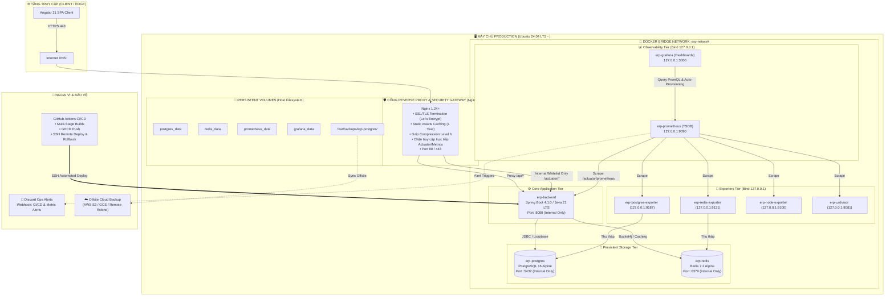

# ERP UTT - TÀI LIỆU THIẾT KẾ KIẾN TRÚC VẬN HÀNH, GIÁM SÁT & QUẢN TRỊ PRODUCTION
**Mã tài liệu:** `ERP-UTT-OPS-SPEC-2026`  
**Phiên bản:** `2.1.0-PROD` (Security Hardening, Extended SRE Runbooks & Disaster Recovery)  
**Trạng thái:** `Phê duyệt áp dụng`  
**Đối tượng áp dụng:** System Administrator, DevOps / SRE Engineers, Backend Technical Lead  

---

## MỤC LỤC

1. [TỔNG QUAN HỆ THỐNG & KIẾN TRÚC VẬN HÀNH](#1-tổng-quan-hệ-thống--kiến-trúc-vận-hành)
2. [CHUẨN HÓA CẤU TRÚC DOCKER MODULES (SRC/MAIN/DOCKER)](#2-chuẩn-hóa-cấu-trúc-docker-modules-srcmaindocker)
3. [ĐẶC TẢ KỸ THUẬT & CẤU HÌNH TỪ SOURCE CODE ĐẾN HẠ TẦNG](#3-đặc-tả-kỹ-thuật--cấu-hình-từ-source-code-đến-hạ-tầng)
   - 3.1. [Tầng Ứng Dụng (Spring Boot 4.1.0 / Java 21 LTS)](#31-tầng-ứng-dụng-spring-boot-410--java-21-lts)
   - 3.2. [Tầng Cổng Biên, Bảo Mật & Reverse Proxy (Nginx)](#32-tầng-cổng-biên-bảo-mật--reverse-proxy-nginx)
   - 3.3. [Tầng Giám Sát Nội Bộ (Prometheus, Grafana & Exporters)](#33-tầng-giám-sát-nội-bộ-prometheus-grafana--exporters)
4. [CHIẾN LƯỢC CẢNH BÁO THEO TIÊU CHUẨN GOOGLE SRE (ALERTING STRATEGY)](#4-chiến-lược-cảnh-báo-theo-tiêu-chuẩn-google-sre-alerting-strategy)
5. [QUY TRÌNH QUẢN TRỊ DỮ LIỆU & PHỤC HỒI THẢM HỌA (BACKUP & DISASTER RECOVERY)](#5-quy-trình-quản-trị-dữ-liệu--phục-hồi-thảm-họa-backup--disaster-recovery)
   - 5.1. [Quy trình Sao lưu Tự động & Offsite Sync](#51-quy-trình-sao-lưu-tự-động--offsite-sync)
   - 5.2. [Quy trình Khôi phục Dữ liệu Chuẩn (Restore Runbook)](#52-quy-trình-khôi-phục-dữ-liệu-chuẩn-restore-runbook)
6. [SỔ TAY XỬ LÝ SỰ CỐ PRODUCTION (EXTENDED SRE INCIDENT RUNBOOK)](#6-sổ-tay-xử-lý-sự-cố-production-extended-sre-incident-runbook)
   - 6.1. [Kịch bản 1: Database Connection Pool Exhaustion & Truy Vấn Bị Treo](#61-kịch-bản-1-database-connection-pool-exhaustion--truy-vấn-bị-treo)
   - 6.2. [Kịch bản 2: Redis Out Of Memory (OOM) & Cache Eviction](#62-kịch-bản-2-redis-out-of-memory-oom--cache-eviction)
   - 6.3. [Kịch bản 3: Chứng Chỉ SSL/TLS Hết Hạn hoặc Lỗi Renewal](#63-kịch-bản-3-chứng-chỉ-ssltls-hết-hạn-hoặc-lỗi-renewal)
   - 6.4. [Kịch bản 4: Pipeline Deploy Bị Treo / SSH Lock / Container Hung](#64-kịch-bản-4-pipeline-deploy-bị-treo--ssh-lock--container-hung)
   - 6.5. [Kịch bản 5: Tràn Ổ Cứng Host VPS (Disk Space Full)](#65-kịch-bản-5-tràn-ổ-cứng-host-vps-disk-space-full)
7. [LỘ TRÌNH TRIỂN KHAI VẬN HÀNH CHUẨN HÓA (4-PHASE ROADMAP)](#7-lộ-trình-triển-khai-vận-hành-chuẩn-hóa-4-phase-roadmap)
8. [CHECKLIST VẬN HÀNH ĐỊNH KỲ (OPERATIONAL READINESS CHECKLIST)](#8-checklist-vận-hành-định-kỳ-operational-readiness-checklist)

---

## 1. TỔNG QUAN HỆ THỐNG & KIẾN TRÚC VẬN HÀNH

### 1.1. Sơ đồ Phân tầng Bảo Mật & Vận Hành (Enterprise Topology)



### 1.2. Ma Trận Dịch Vụ & Docker Healthcheck Specifications

| Tên Service | Image & Version | Listen Binding | Healthcheck Configuration | Vai Trò Vận Hành |
|---|---|---|---|---|
| **backend-service** | `erp-backend:${TAG}` | `127.0.0.1:8080` | `wget -q --spider http://localhost:8080/actuator/health` | Xử lý Core API & JWT Auth |
| **postgresql** | `postgres:16-alpine` | `127.0.0.1:5432` | `pg_isready -U erp_user -d erp_dev` | Cơ sở dữ liệu giao dịch chính |
| **redis** | `redis:7-alpine` | `127.0.0.1:6379` | `redis-cli -a erp_redis_2026 ping` | Cache dữ liệu & Bucket4j Rate Limiting |
| **prometheus** | `prom/prometheus:v2.51.0` | `127.0.0.1:9090` | `wget -q --spider http://localhost:9090/-/healthy` | Thu thập & lưu trữ Time-Series Metrics |
| **grafana** | `grafana/grafana:11.1.0` | `127.0.0.1:3000` | `wget -q --spider http://localhost:3000/api/health` | Trực quan hóa Dashboard & Quản lý cảnh báo |
| **postgres-exporter** | `prometheuscommunity/postgres-exporter:v0.15.0` | `127.0.0.1:9187` | Depends on Postgres Healthy | Đo lường Connection & Query PostgreSQL |
| **redis-exporter** | `oliver006/redis_exporter:v1.58.0` | `127.0.0.1:9121` | Depends on Redis Healthy | Đo lường Memory & Hit/Miss Redis |
| **node-exporter** | `prom/node-exporter:v1.7.0` | `127.0.0.1:9100` | Host Metrics Stream | Đo lường CPU, RAM, Disk, Network VPS |
| **cadvisor** | `gcr.io/cadvisor/cadvisor:v0.49.1` | `127.0.0.1:8081` | Container Engine Stream | Đo lường tài nguyên từng Docker Container |

---

## 2. CHUẨN HÓA CẤU TRÚC DOCKER MODULES (SRC/MAIN/DOCKER)

Toàn bộ các file cấu hình và compose service được chuẩn hóa theo mô hình kế thừa tại `src/main/docker/`:

```
backend-service/src/main/docker/
├── app.yml                                    # Chạy Backend Core (extends postgresql.yml, redis.yml)
├── infra.yml                                  # Chạy Hạ tầng dữ liệu (Postgres + Redis)
├── postgresql.yml                             # Khởi tạo PostgreSQL 16 + Healthcheck
├── redis.yml                                  # Khởi tạo Redis 7 + Healthcheck
│
├── monitoring.yml                             # Tổng hợp toàn bộ Monitoring Stack
├── prometheus.yml                             # Service Prometheus 2.51+ (bind 127.0.0.1:9090)
├── grafana.yml                                # Service Grafana 11.1+ (bind 127.0.0.1:3000)
├── postgres-exporter.yml                      # Service PostgreSQL Metrics Exporter (bind 127.0.0.1:9187)
├── redis-exporter.yml                         # Service Redis Metrics Exporter (bind 127.0.0.1:9121)
│
├── prometheus/                                # [Cấu hình Prometheus Engine]
│   ├── prometheus.yml                         # Scrape targets: Backend, Postgres, Redis, Node, cAdvisor
│   └── rules/
│       └── alerts.yml                         # Bộ Rules cảnh báo SRE 4 Golden Signals
│
└── grafana/                                   # [Cấu hình & Tự động nạp Grafana]
    ├── provisioning/
    │   ├── datasources/
    │   │   └── datasources.yml                # Auto-provision Prometheus Datasource
    │   └── dashboards/
    │       └── dashboards.yml                 # Auto-provision JSON Dashboards Provider
    └── dashboards/
        └── overview.json                      # Dashboard tổng quan: RPS, p95 Latency, JVM Heap, HikariCP
```

---

## 3. ĐẶC TẢ KỸ THUẬT & CẤU HÌNH TỪ SOURCE CODE ĐẾN HẠ TẦNG

### 3.1. Tầng Ứng Dụng (Spring Boot 4.1.0 / Java 21 LTS)

#### A. Dependency Pom.xml
Dự án sử dụng **Spring Boot 4.1.0** trên nền **Java 21 LTS**. Cần đảm bảo có dependency Micrometer Prometheus trong `backend-service/pom.xml`:

```xml
<dependency>
    <groupId>io.micrometer</groupId>
    <artifactId>micrometer-registry-prometheus</artifactId>
</dependency>
```

#### B. Cấu hình Tham số Giám sát Production (`application-prod.yaml`)

```yaml
management:
  endpoints:
    web:
      exposure:
        include: health,info,metrics,prometheus
      base-path: /actuator
  endpoint:
    health:
      show-details: always
      probes:
        enabled: true
    prometheus:
      enabled: true
  metrics:
    tags:
      application: backend-service
      env: production
    distribution:
      percentiles-histogram:
        http.server.requests: true # Đo lường chi tiết phân vị p50, p95, p99 Latency
      slo:
        http.server.requests: 50ms, 100ms, 200ms, 500ms, 1s, 2s
```

---

### 3.2. Tầng Cổng Biên, Bảo Mật & Reverse Proxy (Nginx)

File cấu hình trên máy chủ: `/etc/nginx/sites-available/erp-utt`

```nginx
# ==============================================================================
# CẤU HÌNH NGINX PRODUCTION CHO ERP-UTT
# ==============================================================================
log_format upstream_time '$remote_addr - $remote_user [$time_local] '
                         '"$request" $status $body_bytes_sent '
                         '"$http_referer" "$http_user_agent" '
                         'rt=$request_time uct="$upstream_connect_time" '
                         'uht="$upstream_header_time" urt="$upstream_response_time"';

server {
    listen 80;
    listen [::]:80;
    server_name <DOMAIN_NAME> <SERVER_IP>;
    return 301 https://$host$request_uri;
}

server {
    listen 443 ssl http2;
    listen [::]:443 ssl http2;
    server_name <DOMAIN_NAME> <SERVER_IP>;

    ssl_certificate /etc/letsencrypt/live/<DOMAIN_NAME>/fullchain.pem;
    ssl_certificate_key /etc/letsencrypt/live/<DOMAIN_NAME>/privkey.pem;
    ssl_protocols TLSv1.2 TLSv1.3;
    ssl_ciphers HIGH:!aNULL:!MD5;

    access_log /var/log/nginx/erp_access.log upstream_time;
    error_log /var/log/nginx/erp_error.log warn;

    # 1. BẢO VỆ ENDPOINT ACTUATOR (Chỉ cho phép localhost & Docker Subnet)
    location /actuator/ {
        proxy_pass http://127.0.0.1:8080;
        proxy_set_header Host $host;
        proxy_set_header X-Real-IP $remote_addr;

        allow 127.0.0.1;
        allow 172.16.0.0/12;
        deny all;
    }

    # 2. PROXY BACKEND API
    location /api/ {
        proxy_pass http://127.0.0.1:8080;
        proxy_http_version 1.1;
        proxy_set_header Connection "";
        
        proxy_set_header Host $host;
        proxy_set_header X-Real-IP $remote_addr;
        proxy_set_header X-Forwarded-For $proxy_add_x_forwarded_for;
        proxy_set_header X-Forwarded-Proto $scheme;

        proxy_connect_timeout 15s;
        proxy_send_timeout 60s;
        proxy_read_timeout 60s;
    }

    # 3. PHỤC VỤ ANGULAR SPA
    location / {
        root /opt/ERP-UTT/frontend/browser;
        index index.html;
        try_files $uri $uri/ /index.html;
    }
}
```

---

### 3.3. Tầng Giám Sát Nội Bộ (Prometheus, Grafana & Exporters)

Tất cả các cổng giám sát được bind vào `127.0.0.1` để ngăn chặn rủi ro lộ lọt thông tin hạ tầng ra Internet.

#### Cách thức Truy cập Bảng điều khiển Grafana & Prometheus an toàn:
Sử dụng **SSH Local Port Forwarding** từ máy cá nhân (Local Workstation):
```bash
ssh -L 3000:127.0.0.1:3000 -L 9090:127.0.0.1:9090 devops@<SERVER_IP>
```
Sau đó mở trình duyệt tại máy cá nhân:
* **Grafana Dashboard:** `http://localhost:3000` (User: `admin` / Password: `admin123456`)
* **Prometheus Targets:** `http://localhost:9090/targets`

---

## 4. CHIẾN LƯỢC CẢNH BÁO THEO TIÊU CHUẨN GOOGLE SRE (ALERTING STRATEGY)

File cấu hình cảnh báo: `backend-service/src/main/docker/prometheus/rules/alerts.yml`

```yaml
groups:
  - name: ERP_System_Alerts
    rules:
      # 1. Ổ Cứng Server sắp đầy (< 15% Free Space)
      - alert: HostDiskSpaceRunningLow
        expr: (node_filesystem_free_bytes{mountpoint="/"} / node_filesystem_size_bytes{mountpoint="/"} * 100) < 15
        for: 5m
        labels:
          severity: critical
        annotations:
          summary: "CẢNH BÁO: Dung lượng ổ đĩa VPS dưới 15%"
          description: "Dung lượng ổ cứng VPS chỉ còn {{ $value | printf \"%.2f\" }}%."

      # 2. Máy chủ VPS bị quá tải CPU liên tục (> 85% trong 5 phút)
      - alert: HostCpuHighUsage
        expr: (100 - (avg by (instance) (rate(node_cpu_seconds_total{mode="idle"}[5m])) * 100)) > 85
        for: 5m
        labels:
          severity: warning
        annotations:
          summary: "CẢNH BÁO: CPU VPS vượt ngưỡng 85%"
          description: "Mức sử dụng CPU trung bình trong 5 phút qua là {{ $value | printf \"%.2f\" }}%."

      # 3. Máy chủ VPS bị đầy RAM (> 90% trong 5 phút)
      - alert: HostMemoryHighUsage
        expr: (1 - (node_memory_MemAvailable_bytes / node_memory_MemTotal_bytes)) * 100 > 90
        for: 5m
        labels:
          severity: critical
        annotations:
          summary: "CẢNH BÁO: RAM máy chủ vượt ngưỡng 90%"
          description: "RAM khả dụng trên host chỉ còn dưới 10% (đang dùng {{ $value | printf \"%.2f\" }}%)."

      # 4. JVM Heap Memory Quá Tải (> 85% trong 5 phút)
      - alert: BackendJvmHeapHighUsage
        expr: (jvm_memory_used_bytes{area="heap"} / jvm_memory_max_bytes{area="heap"} * 100) > 85
        for: 5m
        labels:
          severity: critical
        annotations:
          summary: "CẢNH BÁO: JVM Heap Memory vượt 85%"
          description: "Ứng dụng Spring Boot đang chiếm {{ $value | printf \"%.2f\" }}% Max Heap."

      # 5. Connection Pool Database Bị Nghẽn (HikariCP Pending Connections > 3 trong 2 phút)
      - alert: DatabasePoolExhaustion
        expr: hikaricp_connections_pending{pool="HikariPool-1"} > 3
        for: 2m
        labels:
          severity: critical
        annotations:
          summary: "NGUY HIỂM: Database Connection Pool bị nghẽn (> 3 pending connections)!"
          description: "Có {{ $value }} yêu cầu kết nối DB đang phải xếp hàng chờ phục vụ liên tục trong 2 phút."

      # 6. Tỉ lệ lỗi HTTP 5xx của Backend quá cao (> 2% trong 3 phút)
      - alert: BackendHighHttp5xxRate
        expr: sum(rate(http_server_requests_seconds_count{status=~"5.."}[5m])) / sum(rate(http_server_requests_seconds_count[5m])) * 100 > 2
        for: 3m
        labels:
          severity: critical
        annotations:
          summary: "TỈ LỆ LỖI BACKEND 5XX VƯỢT QUÁ 2%"
          description: "Tỉ lệ lỗi máy chủ 5xx hiện đang ở mức {{ $value | printf \"%.2f\" }}%."

      # 7. Container Bị Crash hoặc Restart Liên Tục (> 2 lần trong 15 phút)
      - alert: ContainerRestartingFrequently
        expr: increase(container_restart_count{name=~"erp-.*"}[15m]) > 2
        for: 1m
        labels:
          severity: critical
        annotations:
          summary: "Container {{ $labels.name }} bị restart bất thường"
          description: "Container {{ $labels.name }} đã khởi động lại {{ $value }} lần trong 15 phút qua."
```

---

## 5. QUY TRÌNH QUẢN TRỊ DỮ LIỆU & PHỤC HỒI THẢM HỌA (BACKUP & DISASTER RECOVERY)

### 5.1. Quy trình Sao lưu Tự động & Offsite Sync

Script thực thi: `deploy/scripts/backup-database.sh`
* Kiểm tra toàn vẹn bằng lệnh `gzip -t "$BACKUP_FILE"`.
* Bắn thông báo khẩn cấp lên Discord qua webhook nếu quá trình dump hoặc gzip bị lỗi.
* Hỗ trợ đồng bộ Offsite lên S3 / Cloud Storage / Remote Server.

Cài đặt Cronjob chạy lúc 2:00 sáng mỗi ngày:
```bash
# crontab -e
0 2 * * * /bin/bash /root/backend-service/deploy/scripts/backup-database.sh >> /var/log/erp-backup.log 2>&1
```

### 5.2. Quy trình Khôi phục Dữ liệu Chuẩn (Restore Runbook)

Khi xảy ra sự cố hỏng dữ liệu hoặc cần diễn tập DR, sử dụng script `deploy/scripts/restore-database.sh`:

```bash
ssh root@<SERVER_IP>
cd ~/backend-service

# Cách 1: Tự động khôi phục bản sao lưu mới nhất (có bước xác nhận YES an toàn)
sudo bash deploy/scripts/restore-database.sh

# Cách 2: Khôi phục một file cụ thể
sudo bash deploy/scripts/restore-database.sh /var/backups/erp-postgres/erp_backup_20260822_020000.sql.gz

# Cách 3: Khôi phục tự động trong kịch bản CI/CD test (bỏ qua xác nhận)
sudo bash deploy/scripts/restore-database.sh /var/backups/erp-postgres/erp_backup_latest.sql.gz --force
```

---

## 6. SỔ TAY XỬ LÝ SỰ CỐ PRODUCTION (EXTENDED SRE INCIDENT RUNBOOK)

### 6.1. Kịch bản 1: Database Connection Pool Exhaustion & Truy Vấn Bị Treo
**Hiện tượng:** Alert `DatabasePoolExhaustion` kích hoạt, API phản hồi chậm hoặc trả về `ConnectionTimeoutException`.

**Các bước xử lý khẩn cấp:**
1. Truy cập vào PostgreSQL container để kiểm tra các câu truy vấn đang chiếm giữ kết nối:
   ```bash
   docker exec -it erp-postgres psql -U erp_user -d erp_dev -c "
   SELECT pid, now() - query_start AS duration, query, state, usename, client_addr 
   FROM pg_stat_activity 
   WHERE state != 'idle' 
   ORDER BY duration DESC;"
   ```
2. Kiểm tra các câu truy vấn đang bị khóa (Blocking Locks / Deadlocks):
   ```bash
   docker exec -it erp-postgres psql -U erp_user -d erp_dev -c "
   SELECT blocked_locks.pid AS blocked_pid,
          blocked_activity.query AS blocked_statement,
          blocking_locks.pid AS blocking_pid,
          blocking_activity.query AS current_statement_in_blocking_process
   FROM  pg_catalog.pg_locks blocked_locks
   JOIN pg_catalog.pg_stat_activity blocked_activity ON blocked_activity.pid = blocked_locks.pid
   JOIN pg_catalog.pg_locks blocking_locks 
       ON blocking_locks.locktype = blocked_locks.locktype
       AND blocking_locks.database IS NOT DISTINCT FROM blocked_locks.database
       AND blocking_locks.relation IS NOT DISTINCT FROM blocked_locks.relation
       AND blocking_locks.page IS NOT DISTINCT FROM blocked_locks.page
       AND blocking_locks.tuple IS NOT DISTINCT FROM blocked_locks.tuple
       AND blocking_locks.virtualxid IS NOT DISTINCT FROM blocked_locks.virtualxid
       AND blocking_locks.transactionid IS NOT DISTINCT FROM blocked_locks.transactionid
       AND blocking_locks.classid IS NOT DISTINCT FROM blocked_locks.classid
       AND blocking_locks.objid IS NOT DISTINCT FROM blocked_locks.objid
       AND blocking_locks.objsubid IS NOT DISTINCT FROM blocked_locks.objsubid
       AND blocking_locks.pid != blocked_locks.pid
   JOIN pg_catalog.pg_stat_activity blocking_activity ON blocking_activity.pid = blocking_locks.pid
   WHERE NOT blocked_locks.granted;"
   ```
3. Ngắt khẩn cấp tiến trình truy vấn chạy chậm (Kill Query):
   ```bash
   docker exec -it erp-postgres psql -U erp_user -d erp_dev -c "SELECT pg_terminate_backend(<BLOCKING_PID>);"
   ```

---

### 6.2. Kịch bản 2: Redis Out Of Memory (OOM) & Cache Eviction
**Hiện tượng:** Redis trả lỗi `OOM command not allowed when used memory > 'maxmemory'` hoặc Backend không ghi được Token/RateLimit vào Redis.

**Các bước xử lý khẩn cấp:**
1. Kiểm tra mức tiêu thụ bộ nhớ chi tiết của Redis:
   ```bash
   docker exec -it erp-redis redis-cli -a erp_redis_2026 info memory
   ```
2. Quét các key có kích thước lớn bất thường:
   ```bash
   docker exec -it erp-redis redis-cli -a erp_redis_2026 --bigkeys
   ```
3. Thiết lập chính sách tự động giải phóng bộ nhớ khi đầy (Eviction Policy):
   ```bash
   docker exec -it erp-redis redis-cli -a erp_redis_2026 CONFIG SET maxmemory 512mb
   docker exec -it erp-redis redis-cli -a erp_redis_2026 CONFIG SET maxmemory-policy allkeys-lru
   ```
4. Xóa các key rác tạm thời nếu cần cứu hệ thống ngay:
   ```bash
   docker exec -it erp-redis redis-cli -a erp_redis_2026 FLUSHDB ASYNC
   ```

---

### 6.3. Kịch bản 3: Chứng Chỉ SSL/TLS Hết Hạn hoặc Lỗi Renewal
**Hiện tượng:** Trình duyệt báo lỗi `NET::ERR_CERT_DATE_INVALID` hoặc `SEC_ERROR_EXPIRED_CERTIFICATE`.

**Các bước xử lý khẩn cấp:**
1. Kiểm tra thời hạn chứng chỉ Let's Encrypt hiện tại:
   ```bash
   certbot certificates
   ```
2. Chạy lệnh gia hạn cưỡng bức (Force Renew):
   ```bash
   sudo certbot renew --force-renewal
   ```
3. Nếu gặp lỗi Port 80 bị chiếm dụng trong quá trình renew:
   ```bash
   # Kiểm tra và reload Nginx
   sudo nginx -t
   sudo systemctl reload nginx
   ```

---

### 6.4. Kịch bản 4: Pipeline Deploy Bị Treo / SSH Lock / Container Hung
**Hiện tượng:** GitHub Actions báo timeout ở bước SSH Deploy hoặc container cũ không chịu dừng (D state).

**Các bước xử lý khẩn cấp:**
1. SSH trực tiếp vào server và kiểm tra container nào đang ở trạng thái `unhealthy` hoặc `restarting`:
   ```bash
   docker ps -a --format "table {{.Names}}\t{{.Status}}\t{{.Ports}}"
   ```
2. Ép dừng và dọn dẹp các container bị treo:
   ```bash
   docker kill erp-backend || true
   docker compose -f src/main/docker/app.yml up -d --force-recreate backend-service
   ```
3. Khôi phục về phiên bản stable gần nhất bằng script 1 chạm:
   ```bash
   sudo bash deploy/scripts/rollback.sh
   ```

---

### 6.5. Kịch bản 5: Tràn Ổ Cứng Host VPS (Disk Space Full)
**Hiện tượng:** Alert `HostDiskSpaceRunningLow` kích hoạt hoặc Postgres báo lỗi `No space left on device`.

**Các bước xử lý khẩn cấp:**
1. Kiểm tra phân vùng ổ đĩa:
   ```bash
   df -h /
   ```
2. Dọn dẹp khẩn cấp Docker Dangling Images và Build Cache:
   ```bash
   docker system prune -af --volumes=false
   ```
3. Dọn dẹp log hệ điều hành Ubuntu:
   ```bash
   journalctl --vacuum-size=100M
   find /var/log/ -name "*.gz" -type f -delete
   ```

---

## 7. LỘ TRÌNH TRIỂN KHAI VẬN HÀNH CHUẨN HÓA (4-PHASE ROADMAP)

| Giai đoạn | Mục tiêu | Các dịch vụ khởi chạy | Kết quả nghiệm thu |
|---|---|---|---|
| **Phase 1: Nền tảng** | Bật Metrics Backend & Database | `micrometer-registry-prometheus`, `postgresql.yml`, `redis.yml` | Endpoint `/actuator/prometheus` trả về dữ liệu metrics nội bộ. |
| **Phase 2: Trực quan hóa** | Dựng Trạm Giám Sát Grafana & Prometheus | `src/main/docker/monitoring.yml` (`prometheus.yml`, `grafana.yml`, `postgres-exporter.yml`, `redis-exporter.yml`) | Truy cập `http://localhost:3000` (qua SSH Tunnel) xem Dashboard JVM, RPS, DB Pool hoàn toàn tự động. |
| **Phase 3: An toàn Dữ liệu** | Backup & Giám sát SLA | `backup-database.sh` + `restore-database.sh` + Cronjob | File `.sql.gz` được tạo định kỳ, kiểm tra toàn vẹn và có quy trình khôi phục sẵn sàng. |
| **Phase 4: Tối ưu & APM** | Nâng cao chất lượng & Phân tích Traces | OpenTelemetry / Sentry Integration | Đo lường chi tiết từng câu lệnh SQL chậm và Stacktrace Exception. |

---

## 8. CHECKLIST VẬN HÀNH ĐỊNH KỲ (OPERATIONAL READINESS CHECKLIST)

### Hằng Ngày (Daily Standup Check - 3 Phút)
- [ ] Kiểm tra kênh cảnh báo **Discord**: Không có Alert mức `CRITICAL`.
- [ ] Mở **Grafana Dashboard**: Tỉ lệ lỗi HTTP 5xx duy trì $< 0.1\%$, HikariCP pending queue $= 0$.

### Hằng Tuần (Weekly Review - 15 Phút)
- [ ] Kiểm tra dung lượng ổ đĩa VPS: `df -h /` (Duy trì mức trống $> 25\%$).
- [ ] Kiểm tra tính toàn vẹn của thư mục Backup: `ls -lh /var/backups/erp-postgres`.
- [ ] Rà soát danh sách Top 5 API có độ trễ cao nhất để lên kế hoạch đánh Index SQL.

### Hằng Tháng (Monthly Audit & Maintenance - 1 Giờ)
- [ ] **Diễn tập Phục hồi Thảm họa (DR Drill):** Thử chạy `restore-database.sh` vào database test để đảm bảo bản backup phục hồi được 100%.
- [ ] Dọn dẹp Docker Dangling Images: `docker system prune -f`.
- [ ] Cập nhật bản vá bảo mật hệ điều hành Ubuntu: `sudo apt-get update && sudo apt-get --only-upgrade install -y nginx docker-ce`.

---
*Tài liệu được soạn thảo và lưu trữ tại [deploy/PRODUCTION_OPERATIONS_MANUAL.md](file:///c:/ERP-UTT/backend-service/deploy/PRODUCTION_OPERATIONS_MANUAL.md) phục vụ công tác chuẩn hóa quy trình DevOps / SRE cho hệ thống ERP UTT.*
