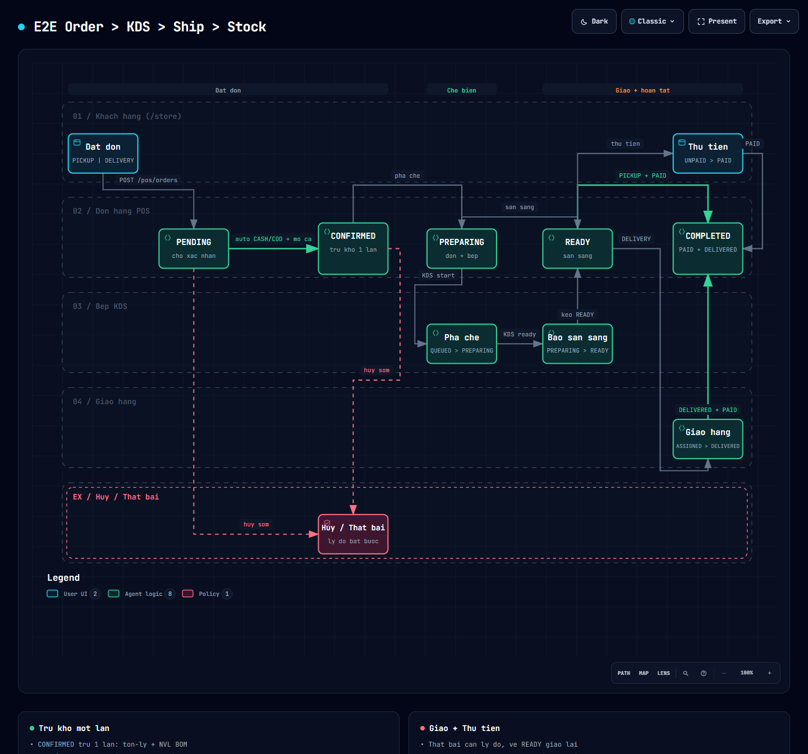
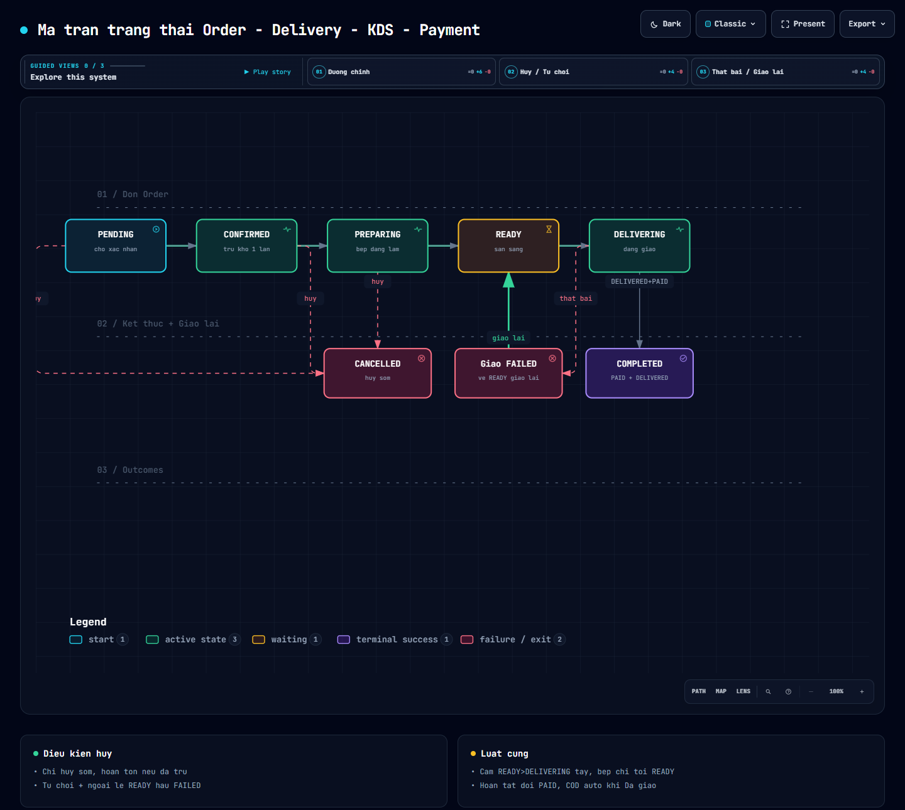
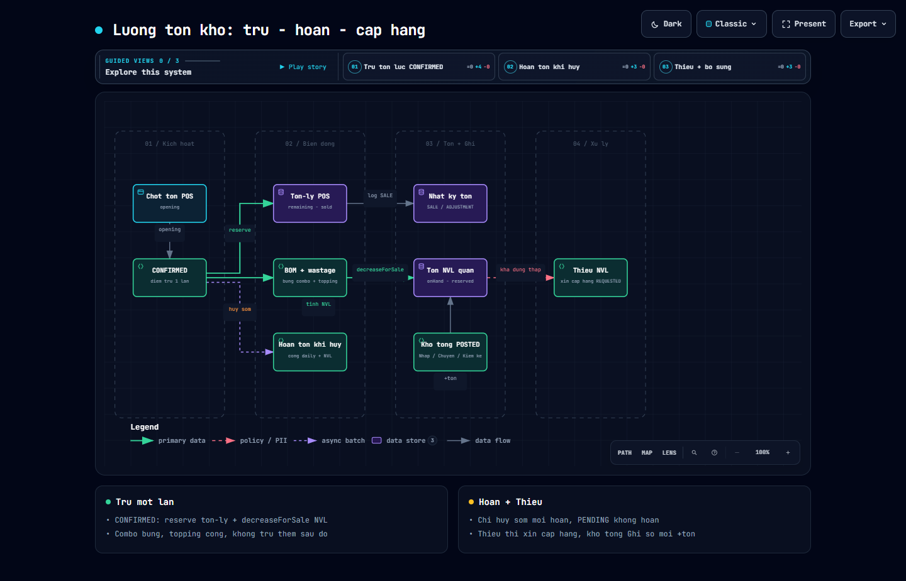
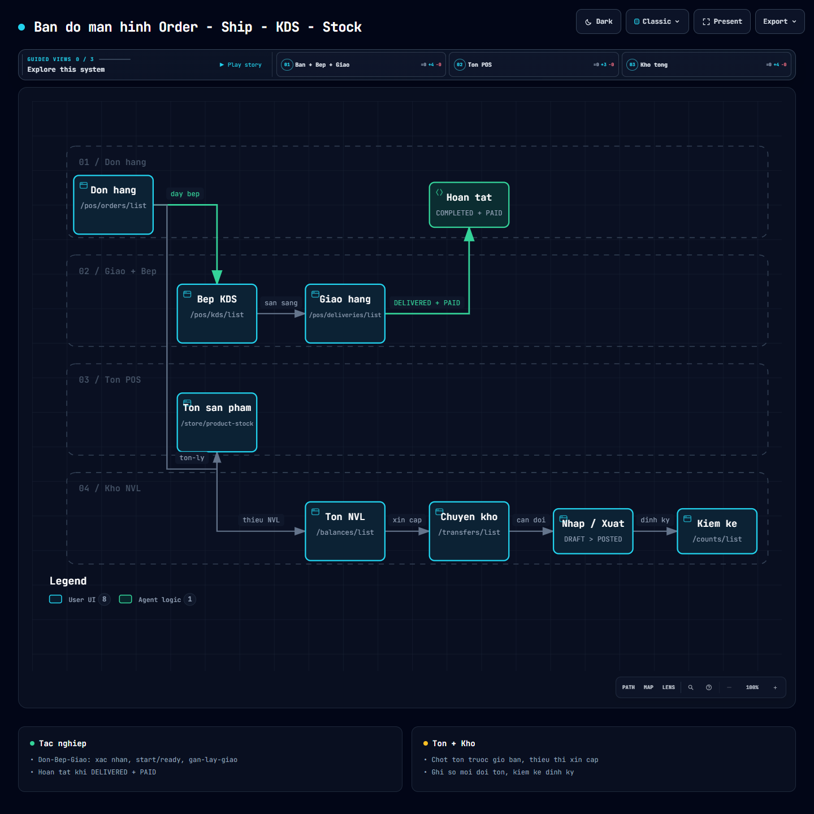

# BA-05 — Nghiệp vụ E2E Order → Ship (Delivery) → KDS → Stock

> Trạng thái: đã triển khai. Phạm vi: đặt đơn POS → pha chế (KDS) → giao hàng → tồn kho (tồn-ly POS + tồn NVL kho quán + chứng từ kho tổng).
> Nguồn rà soát: `BE/core-model` (domain), `BE/backend-service` (`controller/*`, `service/pos/*`, `service/inv/*`, `PosFlow.java`), `frontend/src/app` (`app.routes.ts`, `features/pos/*`, `features/store-ops/*`, `features/warehouses/*`), `docs/BA-04`, `docs/van-de-phan-quyen-luong-dat-don.md`, `BE/Permission.md`.
> Bản lập: 2026-09-22.

## 0. Sơ đồ trực quan (mở bằng trình duyệt — có sáng/tối, phóng to/thu nhỏ, tìm kiếm, dẫn truyện từng bước, xuất PNG/SVG)

| # | Sơ đồ | Minh họa cho mục | File |
|---|---|---|---|
| D1 | Luồng E2E Order → KDS → Ship → Stock | Mục 2 | [`diagrams/e2e-order-ship-kds-stock.html`](diagrams/e2e-order-ship-kds-stock.html) |
| D2 | Ma trận trạng thái Order – Delivery – KDS – Payment | Mục 3 | [`diagrams/state-matrix-order-delivery-kds.html`](diagrams/state-matrix-order-delivery-kds.html) |
| D3 | Luồng tồn kho: trừ – hoàn – cấp hàng | Mục 4 | [`diagrams/stock-flow-deduct-release.html`](diagrams/stock-flow-deduct-release.html) |
| D4 | Bản đồ màn hình POS + Kho | Mục 5 | [`diagrams/screens-map-pos-kho.html`](diagrams/screens-map-pos-kho.html) |
| D5 | Luồng thanh toán: thu tay – COD – online – hoàn tiền | Mục 10 | [`diagrams/payment-sequence-cash-cod-online-refund.html`](diagrams/payment-sequence-cash-cod-online-refund.html) |

> Ghi chú: D2 là bản rút gọn trực quan (không vẽ nút REJECTED riêng — xem đầy đủ ở bảng mục 3.1; trạng thái `Giao FAILED` nằm cùng band kết thúc với cạnh quay về READY). Bảng chữ trong các mục dưới vẫn là chuẩn đối chiếu đầy đủ.

---

## 1. Tổng quan luồng E2E

### 1.1. Khái niệm rút gọn

Hệ thống **không có entity `Shipment`**. "Ship" = **`OrderDelivery`** (quan hệ 1-1 với `Order`).

| Khái niệm | Bảng/entity | Ý nghĩa nghiệp vụ |
|---|---|---|
| `Order` | `orders` | Đơn bán (PICKUP mang đi / DELIVERY giao tận nơi) |
| `OrderItem` + `OrderItemTopping` | `order_item`, `order_item_topping` | Dòng món + topping |
| `OrderDelivery` | `order_delivery` | Phiếu giao hàng, thay cho Shipment |
| `OrderStatusHistory` | `order_status_history` | Nhật ký chuyển trạng thái đơn |
| `KdsTicket` + `KdsTicketItem` | `kds_ticket`, `kds_ticket_item` | Vé bếp (trạm `BAR`), 1 ticket/đơn |
| `PaymentIntent`, `Refund`, `VoucherUsage` | — | Thanh toán online, hoàn tiền, voucher |
| `Cart*` | `cart`, `cart_item` | Giỏ hàng, sau tạo đơn → `CONVERTED` |
| Tồn-ly POS | `branch_variant_daily_stock` + `branch_variant_stock_log` | Tồn "ly" theo biến thể/ngày/chi nhánh — trừ khi CONFIRMED |
| Tồn NVL realtime | `material_stock_balance` (kho của quán) | Tồn nguyên vật liệu quy từ BOM — trừ cùng lúc CONFIRMED |
| Kho tổng | `warehouse`, `material`, `stock_in/out/transfer/count` | Chứng từ kho chuẩn DRAFT → POSTED, quản lý ở module Kho |

### 1.2. Sơ đồ E2E (dạng text)

```
Khách (store / POS)
  │ POST /pos/orders (orderType=PICKUP|DELIVERY, payment=CASH|COD|VNPAY|MOMO|BANK_TRANSFER)
  ▼
Order=PENDING
  │ IF (CASH|COD + chi nhánh đang mở) → auto CONFIRMED
  │ ELSE chờ staff xác nhận tay (VNPAY/MOMO/BANK_TRANSFER ở lại PENDING)
  ▼
CONFIRMED ──(1 transaction)──► [reserve tồn-ly] + [deduct NVL theo BOM] + [tạo KDS QUEUED] (+ auto-assign delivery PENDING nếu DELIVERY)
  ▼
KDS: QUEUED →(start)→ PREPARING →(ready)→ READY        ║  Order song song: CONFIRMED → PREPARING → READY
  ▼
PICKUP: READY →(thu tiền PAID)→ COMPLETED              ║  KDS → SERVED (tự động, bếp không bấm tay)
DELIVERY: READY →(gán shipper ASSIGNED → lấy hàng PICKED_UP → đi giao DELIVERING)→ DELIVERED → COMPLETED (COD auto PAID)
  │
  └── FAILED (thiếu lý do là chặn) → Order về READY → gán lại → giao lại
  └── Hủy/Từ chối (chỉ PENDING/CONFIRMED/PREPARING + READY-hậu-FAILED) → hoàn tồn (nếu đã trừ) + Refund PENDING (nếu đã PAID)
```

### 1.3. Hai nhánh kết thúc

| Nhánh | Chuỗi trạng thái Order | Điều kiện hoàn tất |
|---|---|---|
| **PICKUP** (mang đi / tại quán) | `PENDING → CONFIRMED → PREPARING → READY → COMPLETED` | `READY + PAID` → `COMPLETED` (nút Hoàn tất) |
| **DELIVERY** (giao tận nơi) | `PENDING → CONFIRMED → PREPARING → READY → DELIVERING → COMPLETED` | `Order=DELIVERING + Delivery=DELIVERED + PAID` → `COMPLETED` |

### 1.4. Vai trò tham gia

| Vai trò | Việc làm |
|---|---|
| Khách hàng (CUSTOMER, `/store`) | Tạo giỏ → đặt đơn → (theo dõi) → nhận hàng. Chỉ thấy đơn của mình. Được `cancel` đơn của mình khi còn sớm. |
| Thu ngân / Quản lý ca (staff, `/admin/pos/orders`) | Xác nhận PENDING, đẩy PREPARING/READY, thu tiền, hoàn tất, hủy/từ chối. |
| Bếp / Pha chế (KDS, `/admin/pos/kds`) | Bắt đầu pha chế → báo sẵn sàng (theo ticket hoặc từng món). Không được bấm "phục vụ xong" tay. |
| Shipper / Điều phối giao hàng (`/admin/pos/deliveries`) | Gán shipper → lấy hàng → đi giao → đã giao / thất bại (bắt buộc lý do). |
| Quản lý tồn POS (`/admin/store/product-stock`) | Chốt tồn đầu ngày (restock), xem lịch sử, xem thiếu NVL, xin cấp hàng. |
| Thủ kho (`/admin/inventory/*`) | Nhập/xuất/chuyển/kiểm kê → Ghi sổ mới ảnh hưởng tồn NVL. Duyệt phiếu chuyển. |

---

## 2. Luồng chi tiết từng bước (happy path + rẽ nhánh)

> ▶ Sơ đồ tương tác: [`D1 — Luồng E2E Order → KDS → Ship → Stock`](diagrams/e2e-order-ship-kds-stock.html) (5 lane: Khách / Đơn POS / Bếp KDS / Giao hàng / Hủy-Thất bại).
>
> [](diagrams/e2e-order-ship-kds-stock.html)

### Bước 0 — Chuẩn bị (điều kiện tiên quyết)
1. Chi nhánh phải **đang mở ca** (`posBranchOpenService.isOpenNow`). Nếu đóng: đơn CASH/COD không auto-confirm, kẹt ở PENDING chờ xử lý.
2. Tồn-ly (`remaining`) và tồn NVL (`available = onHand - reserved`) phải đủ. Lúc đặt đơn và lúc xác nhận đều check; thiếu → chặn với message `NVL <code> không đủ (cần X <đv> cho đơn <code>)`.
3. Khách đặt từ `/store` (giỏ `Cart`) hoặc staff tạo hộ. API `POST /api/v1/pos/orders` (CUSTOMER-only, staff ACCOUNT gọi sẽ bị ném lỗi — đây là điểm gãy phân quyền đã biết).

### Bước 1 — Tạo đơn (PENDING)
- Input: `branchId*, orderType (PICKUP|DELIVERY), items[{variantId, quantity, sugar/ice, topping}], paymentMethod (CASH|COD|VNPAY|MOMO|BANK_TRANSFER), deliveryAddress (nếu DELIVERY), voucher?`.
- Hệ thống: sinh `orderCode HD-...` (sequence theo ngày), `status=PENDING`, `paymentStatus=UNPAID`, snapshot giá (`unitPrice/totalPrice`), tính `totalCogs` từ BOM, ghi `OrderStatusHistory (null → PENDING)`.
- Rẽ nhánh ngay:
  - `CASH/COD + quán mở` → **auto `PENDING → CONFIRMED`** trong cùng transaction (reserve + deduct + tạo ticket + tạo delivery PENDING).
  - Còn lại (`VNPAY/MOMO/BANK_TRANSFER` hoặc quán đóng) → ở lại `PENDING`, chờ staff bấm **Xác nhận** ở màn Đơn hàng.

### Bước 2 — Xác nhận (PENDING → CONFIRMED) — điểm trừ kho duy nhất
- Ai: staff có `pos:order:update` (nút **Xác nhận**), hoặc auto như trên.
- Điều kiện: `canOrderTransition(PENDING → CONFIRMED)` + đủ tồn-ly + đủ NVL.
- Side-effect nguyên tử (1 transaction, chống trừ 2 lần):
  1. `reserve`: `branch_variant_daily_stock.remaining -= qty, sold += qty` (lock `PESSIMISTIC_WRITE`), log `SALE "Reserve khi CONFIRMED"`. Combo bung `ComboItem × qty`.
  2. `deductForOrder`: aggregate `BOM(variant) × qty × (1+wastage%)` + topping (`materialQuantity × qty`), gọi `decreaseForSale` trừ `material_stock_balance` kho bán của chi nhánh. Variant không BOM → bỏ qua; topping chưa link NVL → bỏ qua.
  3. `createOnOrderConfirmed` (idempotent): 1 ticket KDS `BAR`, `queueNo` tăng theo ngày/branch, `status=QUEUED`.
  4. Nếu `orderType=DELIVERY`: đảm bảo `OrderDelivery PENDING` (auto-assign).
- Sau bước này các bước sau **không trừ thêm**.

### Bước 3 — Pha chế KDS (CONFIRMED → PREPARING → READY)
- Bếp mở **Bếp (KDS)** → board 3 cột `QUEUED | PREPARING | READY`, auto-refresh 15s.
- `Bắt đầu pha chế` (`POST /kds/tickets/{id}/start`): ticket `QUEUED → PREPARING`, kéo Order `→ PREPARING` (nếu cho phép).
- `Báo sẵn sàng` (`POST .../ready` hoặc tiến độ từng món `POST /items/{id}/progress {preparedQuantity,status}` đủ hết → ticket `READY`): kéo Order `→ READY`.
- Quy tắc: bếp **chỉ tới READY**. Nút `serve` luôn ném `KDS_400_INVALID_STATUS_TRANSITION`. `SERVED` do hệ thống tự đánh khi đơn `DELIVERING/COMPLETED`. Ticket `SERVED/CANCELLED` tự biến khỏi board.
- Cho phép thao tác 2 chiều: staff cũng có thể bấm **Pha chế / Sẵn sàng** từ màn Đơn hàng (`syncFromOrder` kéo ticket theo).

### Bước 4a — Kết thúc PICKUP (READY → COMPLETED)
- Staff màn Đơn hàng: bấm **Thu tiền** (`POST /{id}/payment {PAID}`) — một chiều, không đảo ngược tay (`PAID → UNPAID` bị cấm; `REFUNDED` chỉ hệ thống set).
- Bấm **Hoàn tất** (`POST /{id}/complete`): chỉ khi `PICKUP + READY + PAID`. Hệ thống `markServedByOrderId` (ticket → SERVED).

### Bước 4b — Giao hàng DELIVERY (READY → DELIVERING → COMPLETED)
Màn **Giao hàng** không có API list riêng — dùng `listOrders(orderType=DELIVERY)` + `GET delivery` từng đơn.

| Thao tác (quyền `pos:delivery:update`) | Chuyển Delivery | Tác động Order |
|---|---|---|
| Gán/đổi shipper (`PUT /{orderId}/assign {shipperId}`) | `PENDING\|FAILED\|ASSIGNED → ASSIGNED` | — (shipper phải ACTIVE, cùng branch, có role hiệu lực) |
| Lấy hàng (`POST /status PICKED_UP`) | `ASSIGNED → PICKED_UP` | — |
| Đi giao (`POST /status DELIVERING`) | `PICKED_UP → DELIVERING` | Yêu cầu Order `READY` → set Order `DELIVERING` |
| Đã giao (`POST /status DELIVERED`) | `DELIVERING → DELIVERED` | COD auto `PAID`; nếu `PAID` + Order `DELIVERING/READY` → Order `COMPLETED` (+ ticket SERVED) |
| Thất bại (`POST /status FAILED {failReason*}`) | `DELIVERING → FAILED` | Order `DELIVERING → READY` (để giao lại). Thiếu `failReason` bị chặn. |
| Hủy đơn → `cancelDelivery` | `* → CANCELLED` | theo hủy đơn |

- Sau `DELIVERED`, staff màn Đơn hàng bấm **Hoàn tất** (điều kiện `DELIVERY + DELIVERING + PAID + delivery DELIVERED`).

### Bước 5 — Hủy / Từ chối / Hoàn tiền (ngoại lệ)
- Ai: staff `pos:order:cancel` + CUSTOMER (allowlist, chỉ đơn mình).
- Chỉ hủy khi `PENDING | CONFIRMED | PREPARING` (+ `READY` **duy nhất** khi `DELIVERY + delivery FAILED` — khách từ chối hàng). Còn lại ném `ORDER_400_ORDER_NOT_CANCELLABLE`.
- Hoàn kho: chỉ khi **đã CONFIRMED** (`current != PENDING`):
  - Tồn-ly: `release` cộng về **dòng hôm nay** (`remaining += qty, sold = max(0, sold-qty)`), log `ADJUSTMENT "Hoàn tồn khi hủy/từ chối"`.
  - NVL: `releaseForOrder` tính lại từ **BOM hiện tại** (xấp xỉ nếu BOM đổi giữa chừng), `increaseForSale`.
  - `PENDING` chưa reserve → không hoàn. `READY` hậu FAILED → **không hoàn** (tính hao hụt).
- Hủy hệ thống: `cancelByOrderId` (ticket → CANCELLED) + `cancelDelivery` (→ CANCELLED).
- Tiền: nếu đã `PAID` → sinh `Refund PENDING (RF-...)`, hệ thống set Order `REFUNDED` (không cho set tay).

---

## 3. Từ điển trạng thái & ma trận chuyển (chuẩn `PosFlow.java`)

> ▶ Sơ đồ tương tác: [`D2 — Ma trận trạng thái`](diagrams/state-matrix-order-delivery-kds.html) (rail Order 5 chặng + nhánh Hủy/Từ chối + vòng Thất bại-Giao lại, 3 dẫn truyện: Đường chính / Hủy / Thất bại).
>
> [](diagrams/state-matrix-order-delivery-kds.html)

### 3.1. Order (8 trạng thái)

```
PENDING → CONFIRMED | CANCELLED | REJECTED
CONFIRMED → PREPARING | CANCELLED | REJECTED
PREPARING → READY | CANCELLED | REJECTED
READY → DELIVERING | COMPLETED        (+ CANCELLED duy nhất khi DELIVERY + delivery FAILED)
DELIVERING → COMPLETED
CANCELLED / REJECTED / COMPLETED: terminal
```

| Chuyển | Ai / nút | Điều kiện & chặn |
|---|---|---|
| `PENDING → CONFIRMED` | Auto (CASH/COD + mở ca) / nút **Xác nhận** (`pos:order:update`) | Đủ tồn-ly + NVL. Đây là điểm trừ kho. |
| `CONFIRMED → PREPARING` | Nút **Pha chế** / KDS `start` | — |
| `PREPARING → READY` | Nút **Sẵn sàng** / KDS `ready` | — |
| `READY → DELIVERING` | **Cấm bấm tay** (`updateStatus` chặn, message "đi giao từ màn Giao hàng") | Chỉ màn Giao hàng (`delivery → DELIVERING`) mới kéo Order sang. |
| `READY → COMPLETED` (PICKUP) | Nút **Hoàn tất** | Phải `PAID`. List UI hiện nút với `strictPayment=false`, BE vẫn từ chối nếu chưa `PAID`. |
| `DELIVERING → COMPLETED` (DELIVERY) | Nút **Hoàn tất** | Phải `PAID` + `delivery=DELIVERED` (`requireDeliveredForComplete`). |
| `* → CANCELLED / REJECTED` | Nút **Hủy (nhập lý do*) / Từ chối** (`pos:order:cancel`) | Chỉ trạng thái sớm (mục Bước 5). `nzOkDisabled` nếu chưa nhập lý do. |

Side-effect theo target (`updateStatus`): `CONFIRMED → tạo ticket`; `PREPARING/READY → sync ticket`; `DELIVERING/COMPLETED → ticket SERVED`; `CANCELLED/REJECTED → ticket CANCELLED + delivery CANCELLED`.

### 3.2. Delivery (7 trạng thái)

```
PENDING → ASSIGNED → PICKED_UP → DELIVERING → DELIVERED | FAILED
FAILED → ASSIGNED (gán lại, giao lại)
* → CANCELLED (khi đơn hủy)
```

`updateStatus` check `canDeliveryTransition` strict; `→ DELIVERING` đòi Order `READY|DELIVERING`; `→ FAILED` bắt buộc `failReason`.

### 3.3. KDS (5 trạng thái)

```
QUEUED → PREPARING | CANCELLED
PREPARING → READY | CANCELLED
READY → SERVED | CANCELLED
```

Tay (`pos:kds_ticket:update`): `start`, `ready`, `progressItem` (cấm `→ SERVED` tay). `serve` bị khóa cứng.

### 3.4. Payment (3 trạng thái)

`UNPAID → PAID` (thu tay) → `REFUNDED` (hệ thống khi hủy đơn đã PAID). Cấm `PAID → UNPAID`, cấm set `REFUNDED` tay.

### 3.5. Chứng từ kho tổng (tham chiếu nhanh, chi tiết xem BA-04)

| Chứng từ | Luồng | Ghi chú |
|---|---|---|
| `StockIn/Out` | `DRAFT → POSTED \| CANCELLED` | `POSTED` mới tăng/giảm `material_stock_balance`. Chỉ tạo tay `PURCHASE/RETURN` (In), `BRANCH_ISSUE/PRODUCTION_ISSUE/WASTAGE` (Out); `TRANSFER_IN/ADJUSTMENT` hệ thống sinh (`INV_400_SYSTEM_VOUCHER_ONLY`). |
| `StockTransfer` | `REQUESTED → PENDING → IN_TRANSIT → RECEIVED` (+ `CANCELLED`) | `approve` (người khác người tạo) → `dispatch` (trừ nguồn) → `receive` nhiều đợt (cộng đích) → `RECEIVED`. `IN_TRANSIT → CANCELLED` bắt buộc lý do, hoàn phần chưa nhận về nguồn. |
| `StockCount` | `DRAFT → IN_PROGRESS → COMPLETED → ADJUSTED` | `start` khóa nhập/xuất/chuyển; `adjust` sinh phiếu `ADJUSTMENT` tăng/giảm tồn thật. |

---

## 4. Logic tồn kho (2 tầng song song lúc CONFIRMED)

> ▶ Sơ đồ tương tác: [`D3 — Luồng tồn kho`](diagrams/stock-flow-deduct-release.html) (Kích hoạt → Biến động → Tồn+Ghi → Xử lý; 3 dẫn truyện: Trừ / Hoàn / Thiếu-bổ sung).
>
> [](diagrams/stock-flow-deduct-release.html)

### 4.1. Tầng 1 — Tồn-ly POS (`branch_variant_daily_stock`)
- Một dòng/ngày/chi nhánh/biến thể: `{openingQuantity, soldQuantity, remainingQuantity}`.
- `checkAvailable` (lúc bỏ giỏ + validate tạo đơn): chỉ **xem** `remaining`, chưa trừ.
- `reserve` (CONFIRMED 1 lần): `remaining -= qty, sold += qty` + log `SALE`.
- `release` (hủy sớm): cộng về **hôm nay** + log `ADJUSTMENT`.
- `restock` (quản lý chốt): set tuyệt đối `remaining = max(0, opening - sold)` + log `RESTOCK`. `ensureToday` tự carryover dư hôm qua; ngày đầu `0`.
- Chống double-deduct: `PREPARING/READY/DELIVERING/COMPLETED` không trừ thêm.

### 4.2. Tầng 2 — Tồn NVL realtime (`material_stock_balance` kho quán)
- `deductForOrder` cùng transaction CONFIRMED: bung BOM + wastage% + topping → `decreaseForSale` từng NVL (check `available = onHand - reserved`, `PESSIMISTIC_WRITE`, lỗi `INV_400_INSUFFICIENT_STOCK`).
- `releaseForOrder` khi hủy sớm: bung lại từ **BOM hiện tại** → `increaseForSale`.
- Resolve kho: chi nhánh không có / có >1 kho bán → bỏ qua + warn / ném lỗi cấu hình. `decrease/increaseForSale` **không check scope** (tin nội bộ).

### 4.3. Tầng 3 — Kho tổng (`StockBalanceMutationService`)
- Dùng cho `StockIn POSTED`, `StockOut POSTED`, `Transfer dispatch/receive/cancel`, `Count adjust` — có `enforceWarehouseAccess`, rollback cả phiếu nếu lỗi.
- `quantityReserved` có ở schema nhưng **chưa luồng nào ghi** (dự phòng).

---

## 5. Hướng dẫn thao tác & quản lý trên từng màn hình (Frontend `/admin`)

> ▶ Sơ đồ tương tác: [`D4 — Bản đồ màn hình`](diagrams/screens-map-pos-kho.html) (lane Đơn hàng / Giao+Bếp / Tồn POS / Kho NVL kèm route từng màn; 3 dẫn truyện: Bán-Giao / Tồn POS / Kho tổng).
>
> [](diagrams/screens-map-pos-kho.html)

> Quy ước quyền (xem `core/config/functions.constants.ts`, `sidebar.constant.ts`):
> `DON_HANG=pos:order:*`, `GIAO_HANG=pos:delivery:*`, `KDS_TICKET=pos:kds_ticket:*` (CREATE/DELETE map về view), `XEM_TON_SAN_PHAM=store:product_stock:view`, `XEM_LICH_SU_TON=store:product_stock_history:view`, `KHO=inv:warehouse:view`, `NGUYEN_VAT_LIEU`, `XEM_TON_KHO=inv:stock_balance:view`, `NHAP_KHO / XUAT_KHO / CHUYEN_KHO / KIEM_KE=inv:*`, `DUYET_DIEU_CHUYEN=inv:stock_transfer:approve`.

### 5.1. Đơn hàng — `/admin/pos/orders/list` (`PosOrderListComponent`, quyền `DON_HANG.VIEW`)
**Mục đích:** xử lý đơn kẹt PENDING + đẩy bếp + thu tiền + hoàn tất + hủy/từ chối. Đơn đủ ĐK đã tự CONFIRMED nên màn này tập trung vào ngoại lệ.

**Bộ lọc:** search mã HD/khách/SĐT (Enter) · chi nhánh · hình thức `PICKUP|DELIVERY` · trạng thái · từ/đến ngày (`dd/MM/yyyy`) · nút Tìm kiếm / Làm mới / **Xuất báo cáo** (`/reports/pos/orders/export`) / Tải lại. Realtime `orderEvents$` (chống burst 3s); `?code=` tự mở detail.

**Bảng:** STT · Mã đơn (link mở detail) · Hình thức · Khách hàng · Tổng tiền · Trạng thái (badge) · Ngày tạo · Thao tác.

**Thao tác:**
- Dòng: `eye` xem (không cần quyền) + icon chuyển trạng thái theo `nextOrderActions` + `dollar` thu tiền — đều yêu cầu `DON_HANG.UPDATE`, disable khi `actionLoading()`.
  - `PENDING → [Xác nhận]`; `CONFIRMED → [Pha chế]`; `PREPARING → [Sẵn sàng]`; `READY+DELIVERY → (sang màn Giao hàng, + Hủy nếu delivery FAILED)`; `READY+PICKUP → [Hoàn tất]`; `DELIVERING → [Hoàn tất]`; `+ [Hủy]/[Từ chối]` khi còn sớm.
- Modal detail: steps `orderStepTitles/orderStepIndex`, lịch sử (`GET /:id/history`), footer nút theo `(orderType, status, paymentStatus, delivery.status)` + **Thu tiền** (ẩn khi `CANCELLED/REJECTED/COMPLETED` hoặc đã `PAID`) + **Đóng**. Modal hủy bắt nhập lý do (`nzOkDisabled` nếu trống); modal thu tiền cảnh báo không đảo ngược.
- API: `GET /pos/orders?...` · `GET /:id` · `POST /:id/status {status,note}` · `POST /:id/cancel {reason,note}` · `POST /:id/complete {note}` · `POST /:id/payment {status,note}` · `GET /:id/history`.

**Steps chuẩn:** Lọc chi nhánh/trạng thái → Tìm kiếm → click mã/eye → xem detail + history → bấm Xác nhận / Pha chế / Sẵn sàng / Hoàn tất / Hủy (nhập lý do) / Từ chối / Thu tiền → reload list + refresh detail.

### 5.2. Giao hàng — `/admin/pos/deliveries/list` (`PosDeliveryBoardComponent`, quyền `GIAO_HANG.VIEW`)
**Mục đích:** chạy `PENDING → ASSIGNED → PICKED_UP → DELIVERING → DELIVERED/FAILED`.

**Bộ lọc:** chỉ chi nhánh + Tìm kiếm / Làm mới / Tải lại (dữ liệu = đơn `orderType=DELIVERY` + `GET delivery` từng đơn).

**Bảng:** STT · Mã đơn · Người nhận (`delivery.receiverPhone ?? receiverName`) · Địa chỉ · Tổng tiền · Trạng thái đơn · Trạng thái giao hàng · Thao tác.

**Thao tác** (đều cần `GIAO_HANG.UPDATE`):
- `PENDING|FAILED|ASSIGNED`: **Gán/đổi shipper** (`user-add`, modal select shipper ACTIVE, `Xác nhận gán` disable nếu chưa chọn).
- `ASSIGNED`: **Lấy hàng** → `PICKED_UP`. `PICKED_UP`: **Đi giao** → `DELIVERING`. `DELIVERING`: **Đã giao** / **Thất bại** (modal lý do bắt buộc).
- API: `GET pos/orders?orderType=DELIVERY` · `GET /pos/deliveries/:orderId` · `PUT /:orderId/assign {shipperId}` · `POST /:orderId/status {status,failReason,note}` · `GET users?status=ACTIVE`.

### 5.3. Bếp KDS — `/admin/pos/kds/list` (`KdsBoardComponent`, quyền `KDS_TICKET.VIEW`)
**Mục đích:** trạm `BAR`, board 3 cột `QUEUED | PREPARING | READY`, auto-refresh 15s silent.

**Bộ lọc:** chi nhánh · search mã HD hoặc `BAR-012` (live) · từ/đến ngày.

**Card:** `ticketCode, orderCode, customerName, totalItems`, badge order status, giờ vào bếp + `elapsedMinutes`, nhãn **Trễ** nếu ≥15p. Click card mở detail. Ticket `SERVED/CANCELLED` tự dọn khỏi board.

**Thao tác** (`KDS_TICKET.UPDATE`): `QUEUED → [Bắt đầu pha chế]`; `PREPARING → [Báo sẵn sàng]`; detail có stepper số lượng (`min 0, max quantity`) → tiến độ từng món / **Món xong** (ẩn khi `READY/SERVED/CANCELLED`). Xong bếp sang màn Đơn/Giao hàng bấm tiếp để ticket `SERVED`.
- API: `GET /pos/kds/tickets?...` · `GET /tickets/:id` · `POST /tickets/:id/start|ready|serve` · `POST /items/:id/progress {preparedQuantity,status}`.

### 5.4. Tồn sản phẩm POS — `/admin/store/product-stock` (`StoreProductStockListComponent`)
**Mục đích:** chốt tồn đầu ngày + theo dõi bán + xin cấp hàng. 2 tabs.

**Quyền:** `XEM_TON_SAN_PHAM.VIEW` (Chốt tồn / Chốt dòng), `XEM_LICH_SU_TON_SAN_PHAM.VIEW` (history), `CHUYEN_KHO.CREATE` (Xin cấp hàng).

**Tab 1 — Tồn theo biến thể:** filter chi nhánh (bắt buộc, auto currentBranch) · ngày kinh doanh · search SKU/tên · Tìm kiếm / Làm mới / **Chốt theo gợi ý** (bulk). Banner hết hàng / sắp hết ≤20% / chưa chốt. Cột: STT · SKU · Tên SP & biến thể · Ngày bán · Tồn đầu ngày · Ước bán được (`capabilityQuantity`) · Đã bán · Tồn còn lại · Trạng thái (`Chưa chốt/Hết/Sắp hết/Đang bán`) · Thao tác (history, chốt dòng `plus-circle`). Modal restock: `branchId* · productId* (dropdown sales 100) · variantId* · openingQuantity* ≥0 · note`. Modal history: `SALE (trừ kho) / RESTOCK (chốt) / ADJUSTMENT (hoàn hủy) / EXPIRED + quantityChange`.

**Tab 2 — NVL & Cấp hàng:** kế hoạch × BOM vs tồn bar. Cột: STT · NVL · ĐVT · Cần · Đã dùng · Tồn bar · Thiếu · Ghi chú (lệch ĐV). Nút **Xin cấp hàng** (confirm) → sinh phiếu `REQUESTED` sang màn Điều chuyển duyệt.

**Steps:** chọn CN + ngày → xem tồn/capability → Chốt lẻ / Chốt bulk theo gợi ý / Xem history → tab NVL → `loadShortage` → Xin cấp hàng.
- API: `GET /pos/stocks?...` · `POST /restock {branchId,variantId,openingQuantity,note}` · `POST /restock-batch` · `GET /history` · `GET /material-shortage` · `POST /request-replenishment` (+ `Sales getProducts`, `getVariants(productId)`).

### 5.5. Tồn kho NVL — `/admin/inventory/balances/list` (read-only, `XEM_TON_KHO.VIEW`)
Filter kho (ACTIVE) · NVL (ACTIVE 100) · search mã/tên. Cột: STT · Kho · Mã NVL · Tên NVL · Tồn hệ thống · Giữ chỗ · Khả dụng (`onHand - reserved`) · Cảnh báo (`Đủ hàng / Sắp hết` khi `available ≤ minStockAlert`). Không có nút tạo/sửa/xóa.
- API: `GET /inv/stocks?...` · `GET /warehouse/:w/material/:m`.

### 5.6. Nhập kho — `/admin/inventory/stock-in(/list)` (`NHAP_KHO.*`)
Model `sourceType=PURCHASE|TRANSFER_IN|RETURN|ADJUSTMENT`, `status=DRAFT|POSTED|CANCELLED`. **Chỉ tạo tay `PURCHASE/RETURN`**; `TRANSFER_IN/ADJUSTMENT` hệ thống sinh (BE chặn `INV_400_SYSTEM_VOUCHER_ONLY`).
Filter: search số phiếu/chứng từ/ghi chú · kho · nguồn · trạng thái · từ/đến ngày (+ filter cột code/kho/nguồn/trạng thái). Cột: checkbox · STT · Mã phiếu · Kho nhập · Nguồn nhập (badge + tooltip chứng từ gốc) · Ngày nhập · Trạng thái · Thao tác.
Nút: **Tạo phiếu nhập** (`CREATE`) · `eye` xem (free) · `edit` (`UPDATE`, chỉ `DRAFT`) · **Ghi sổ** (`DRAFT + UPDATE`, tồn tăng, khóa sửa) · **Hủy** (`DELETE` → thực chất `PATCH CANCELLED`, không xóa cứng) · batch-delete báo không hỗ trợ.
Modal (xl): `code` disabled (Mới-tự sinh) · `warehouseId*` · `sourceType*` · nếu `PURCHASE` dropdown PO (`APPROVED/PARTIALLY_RECEIVED`, lọc kho — cách duy nhất set `sourceReferenceId`) else textbox mã chứng từ · `inDate*` · lines `materialId*/batchNo/expiryDate/quantity* (>0, ≤ remaining PO, max 3 lẻ)/unitPrice* (≥0, max 2 lẻ)` + hint remaining + grandTotal. Từ PO `?poId=` tự mở create.
- API: `GET/POST /inv/stock-ins` · `GET/PUT /:id` · `PATCH /:id/status {POSTED|CANCELLED}`.
- Steps: Tạo nháp → Sửa DRAFT → Ghi sổ / Hủy.

### 5.7. Xuất kho — `/admin/inventory/stock-out(/list)` (`XUAT_KHO.*`)
Model `destinationType=BRANCH_ISSUE|PRODUCTION_ISSUE|TRANSFER_OUT|WASTAGE|ADJUSTMENT`. **Chỉ tạo tay `BRANCH_ISSUE/PRODUCTION_ISSUE/WASTAGE`.** Filter/cột/nút như Nhập kho (khác Mục đích xuất, Ngày xuất, Mã yêu cầu/Đơn vị nhận). Điểm riêng: dropdown NVL hiện `(tồn:X)/(hết tồn)`, disable khi `available==0`, dòng báo `Khả dụng / vượt tồn!`, submit chặn `isOverAvailable` trước POST (tránh `INSUFFICIENT_STOCK` lúc Ghi sổ).
- API: `/inv/stock-outs` (tương tự stock-in) + `getBalance` check tồn.

### 5.8. Chuyển kho — `/admin/inventory/transfers/list` (`CHUYEN_KHO.*` + `DUYET_DIEU_CHUYEN`)
Model `REQUESTED|PENDING|IN_TRANSIT|RECEIVED|CANCELLED` + helper `canEdit/Approve/Dispatch/Receive/Cancel`.
Filter: kho đi/đến (chung `warehouseId`) · trạng thái · search mã. Cột: STT · Mã phiếu · Kho đi→đến · Ngày chuyển · Số dòng · Trạng thái · Thao tác.
Nút: **Tạo phiếu chuyển** (`CREATE`) · `eye` (free) · `edit` (`PENDING|REQUESTED + UPDATE`) · **Duyệt/Từ chối** (`REQUESTED + approve`, reject bắt buộc reason, người duyệt ≠ người tạo) · **Xuất hàng** (`PENDING + UPDATE`, confirm trừ tồn nguồn) · **Nhận hàng** (`IN_TRANSIT + UPDATE`, modal nhận từng phần, bỏ trống = không nhận đợt này, không vượt remaining) · **Hủy** (`REQUESTED|PENDING|IN_TRANSIT + UPDATE`; `IN_TRANSIT/REQUESTED` bắt buộc reason). Form chặn `from==to`, trùng NVL, vượt `availableMap` kho đi.
Steps chuẩn: Tạo `PENDING/REQUESTED` → Duyệt (`POST approve {approved,reason}`) → Xuất hàng (`POST dispatch`) → Nhận nhiều đợt (`POST receive {items:[{itemId,receivedQuantity}]}`) → `RECEIVED` | Hủy (`POST cancel {reason}`). Phiếu `REQUESTED` từ màn Tồn sản phẩm chờ duyệt tại đây.
- API: `GET /inv/transfers?...` · `GET/:id` · `POST/PUT /` · `POST /:id/dispatch|approve|receive|cancel`.

### 5.9. Kiểm kê — `/admin/inventory/counts` (`KIEM_KE.*`)
Model `DRAFT|IN_PROGRESS|COMPLETED|ADJUSTED`, `canEdit=DRAFT|IN_PROGRESS`, `canDelete=DRAFT`. Luồng `DRAFT → start → IN_PROGRESS → complete → COMPLETED → adjust → ADJUSTED`.
Filter kho · trạng thái · search mã. Cột: STT · Mã phiếu · Kho · Ngày kiểm · Số dòng · Chênh lệch (sum variance) · Trạng thái · Thao tác.
Nút: **Tạo phiếu kiểm kê** (`CREATE`, bắt buộc `warehouseId/countDate + ≥1 dòng {materialId, countedQuantity ≥0, note}`, hiện tồn hệ thống + chênh lệch dự kiến live) · `eye` · `edit` Nhập số đếm (`canEdit + UPDATE`, lock kho/ngày) · **Bắt đầu** (`DRAFT + UPDATE`, khóa nhập/xuất/chuyển) · `delete` (chỉ `DRAFT + DELETE`) · **Chốt** (`IN_PROGRESS + UPDATE`, tính chênh lệch) · **Điều chỉnh tồn** (`COMPLETED + UPDATE`, tăng/giảm tồn thật + sinh phiếu ADJUSTMENT). Modal detail steps 4 chặng + stats dòng kiểm/dòng lệch/tổng chênh lệch.
- API: `/inv/stock-counts` + `/:id/start|complete|adjust`, `DELETE /:id`.

---

## 6. Ma trận quyền tóm tắt (module luồng)

| Màn | Xem | Thao tác | Ghi chú |
|---|---|---|---|
| Đơn hàng | `pos:order:view` | `pos:order:update` (chuyển/TT), `pos:order:cancel` (hủy) | CUSTOMER bị chặn `updateStatus` (allowlist chỉ `view/cancel` đơn mình); `create` CUSTOMER-only |
| Giao hàng | `pos:delivery:view` | `pos:delivery:update` (assign + status) | CUSTOMER bypass chỉ đơn mình |
| KDS | `pos:kds_ticket:view` | `pos:kds_ticket:update` (start/ready/progress) | `serve` khóa cứng mọi role |
| Tồn SP | `store:product_stock:view` | cùng quyền (chốt), history riêng, `inv:stock_transfer:create` (xin cấp) | `restock` check tay `pos:order:update`, chặn CUSTOMER |
| Tồn NVL | `inv:stock_balance:view` | — (read-only) | — |
| Nhập/Xuất | `inv:stock_in/out:view` | `create/update/delete` tương ứng | `POSTED` khóa sửa |
| Chuyển | `inv:stock_transfer:view` | `create/update` (+ `approve` riêng) | Duyệt ≠ người tạo |
| Kiểm kê | `inv:stock_count:view` | `create/update/delete` | Khóa kho khi đếm |

Điểm gãy đã biết (`docs/van-de-phan-quyen-luong-dat-don.md`): 1 luồng đặt đơn chịu 2 bộ luật (identity CUSTOMER vs role ACCOUNT) — tiền lệ tách endpoint (`pickup-slot` public, `branches/mine`).

---

## 7. Ngoại lệ & quy tắc vận hành cần nhớ

1. **Cấm `READY → DELIVERING` tay** ở màn Đơn hàng — phải đi từ màn Giao hàng (nút Đi giao).
2. **Nút Hoàn tất hiện nhưng BE từ chối** nếu chưa `PAID` (UI `strictPayment=false`). Luôn **Thu tiền trước**.
3. **Thất bại giao hàng bắt buộc lý do**, đơn về `READY` để giao lại; chỉ `READY + delivery FAILED` mới được Hủy (tính hao hụt, không hoàn kho).
4. **Bếp chỉ tới READY**, không bấm SERVED tay; ticket SERVED do đơn `DELIVERING/COMPLETED` kéo.
5. **Trừ kho 1 lần duy nhất lúc CONFIRMED**; hủy `PENDING` không hoàn; hủy muộn sau `PREPARING` vẫn hoàn (trừ trường hợp #3).
6. **Ghi sổ kho mới đổi tồn**; `POSTED` khóa sửa; kiểm kê `IN_PROGRESS` khóa nhập/xuất/chuyển.
7. **Chuyển kho duyệt 2 phe**: người tạo ≠ người duyệt; `IN_TRANSIT` hủy bắt buộc lý do + hoàn phần chưa nhận.
8. `DATABASE_SCHEMA.md` hiện **lạc hậu** (thiếu POS/INV) — lấy `PosFlow.java` + domain làm chuẩn trạng thái.

---

## 8. Tham chiếu API nhanh

| Nhóm | Base | Endpoint chính |
|---|---|---|
| Order | `/api/v1/pos/orders` | `POST /` · `GET /?...` · `GET /{id}` · `POST /{id}/status` · `POST /{id}/cancel` · `POST /{id}/complete` · `POST /{id}/payment` · `GET /{id}/history` |
| Delivery | `/api/v1/pos/deliveries` | `GET /{orderId}` · `PUT /{orderId}/assign` · `POST /{orderId}/status` |
| KDS | `/api/v1/pos/kds` | `GET /tickets?...` · `GET /tickets/{id}` · `GET /tickets/by-order/{orderId}` · `POST /tickets/{id}/start|ready|serve` · `POST /tickets/ensure/{orderId}` · `POST /items/{itemId}/progress` |
| Tồn POS | `/api/v1/pos/stocks` | `GET /` · `GET /history` · `GET /material-shortage` · `POST /request-replenishment` · `POST /restock|restock-batch` |
| Kho tổng | `/api/v1/inv/*` | `/stocks`, `/stock-ins`, `/stock-outs`, `/transfers (+/dispatch|approve|receive|cancel)`, `/stock-counts (+/start|complete|adjust)` |

---

## 9. Sơ đồ màn hình → trạng thái (treo ở quầy / kho)

```
STORE (khách) → PENDING ── Đơn hàng: Xác nhận ──► CONFIRMED ── Đơn/KDS: Pha chế ──► PREPARING ── Đơn/KDS: Sẵn sàng ──► READY
                                                                                                                              │
                                                              PICKUP: Thu tiền + Hoàn tất ──► COMPLETED ◄── DELIVERY: Giao hàng (Gán → Lấy → Đi giao → Đã giao) + Hoàn tất
Tồn SP: Chốt đầu ngày (trước bán) ──► bán trừ tồn-ly + NVL (lúc Xác nhận) ──► thiếu → Xin cấp hàng ──► Chuyển kho: Duyệt → Xuất → Nhận ──► Nhập/Xuất/Kiểm kê điều chỉnh tồn NVL
```

---

## 10. Luồng thanh toán & hoàn tiền (hiện trạng: CASH/COD chạy đủ, online còn dở)

> Bản đầy đủ để đọc nghiệp vụ và code: [`BA-06 — Module Thanh toán`](BA-06-payment.md). Mục này chỉ tóm tắt.

> ▶ Sơ đồ tương tác: [`D5 — Luồng thanh toán`](diagrams/payment-sequence-cash-cod-online-refund.html) (4 chặng: Thu tay CASH / COD auto / Online còn thiếu / Hoàn tiền; 3 dẫn truyện).
>
> [](diagrams/payment-sequence-cash-cod-online-refund.html)

Chuẩn trạng thái: `Payment {UNPAID, PAID, REFUNDED}` (`PosFlow.java:39-43`), `paymentMethod {CASH|COD|VNPAY|MOMO|BANK_TRANSFER}` (`CreateOrderRequest`). Mọi đơn sinh ra đều `UNPAID`.

### 10.1. CASH (pickup tại quầy) — chạy đủ
`CUSTOMER POST /orders {CASH}` → `PENDING` → (quán mở) auto `CONFIRMED` → KDS/bar → staff `POST /{id}/payment {PAID}` (`pos:order:update`, CUSTOMER bị chặn) → `READY → COMPLETED` (cửa `complete` từ chối nếu chưa `PAID`).

### 10.2. COD (delivery) — chạy đủ, thu tự động
Như CASH + luồng ship; khi shipper báo `DELIVERED`, BE tự set `PAID` (nếu còn `UNPAID`) rồi tự `COMPLETED` (`DeliveryServiceImpl:150-164`). Staff giao hàng (`pos:delivery:update`) gián tiếp đổi payment.

### 10.3. VNPAY / MOMO / BANK_TRANSFER — kẹt ở PENDING (chưa implement)
`POST /orders {VNPAY|MOMO|BANK_TRANSFER}` → `PENDING` rồi **dừng**: không sinh `PaymentIntent` (bảng chết — có entity + DDL + quyền nhưng không repo/service/controller), không `payUrl`, không endpoint webhook/callback, không verify chữ ký, không job quét `expires_at`. Checkout FE hiện khóa cứng `COD` (delivery) / `CASH` (pickup), dòng “VNPay/MoMo sắp ra mắt”. Muốn chạy phải: sinh intent + pay-url → mở `POST /{id}/payment` cho CUSTOMER (đang chặn, có `TODO [VNPay Sprint]`) → webhook verify → `PAID` + `CONFIRMED`.

### 10.4. Hoàn tiền — chỉ tạo phiếu PENDING
Hủy đơn đã `PAID` (staff `pos:order:update` hoặc khách tự hủy đơn mình) → hệ thống sinh `Refund PENDING (RF-...)` + set đơn `REFUNDED` (`refundIfPaid`). Hết: DB cho phép `APPROVED/PROCESSED/REJECTED` nhưng không code nào chuyển, `processedBy/processedAt/transactionId` luôn trống, không API duyệt/chi, màn `pos/refunds` coming-soon.

### 10.5. Luật tiền (bắt buộc nhớ)
- Một chiều `UNPAID → PAID`; cấm `PAID → UNPAID` tay (“hãy hủy để hoàn tiền”); cấm set `REFUNDED` tay (chỉ qua hủy đơn).
- Thu tay idempotent logic (đã `PAID` mà thu nữa thì trả về nguyên), nhưng không có `Idempotency-Key` như lúc tạo đơn.
- Voucher tính vào `total` lúc tạo đơn và hoàn (`ACTIVE → CANCELLED`) khi hủy — độc lập với payment.
