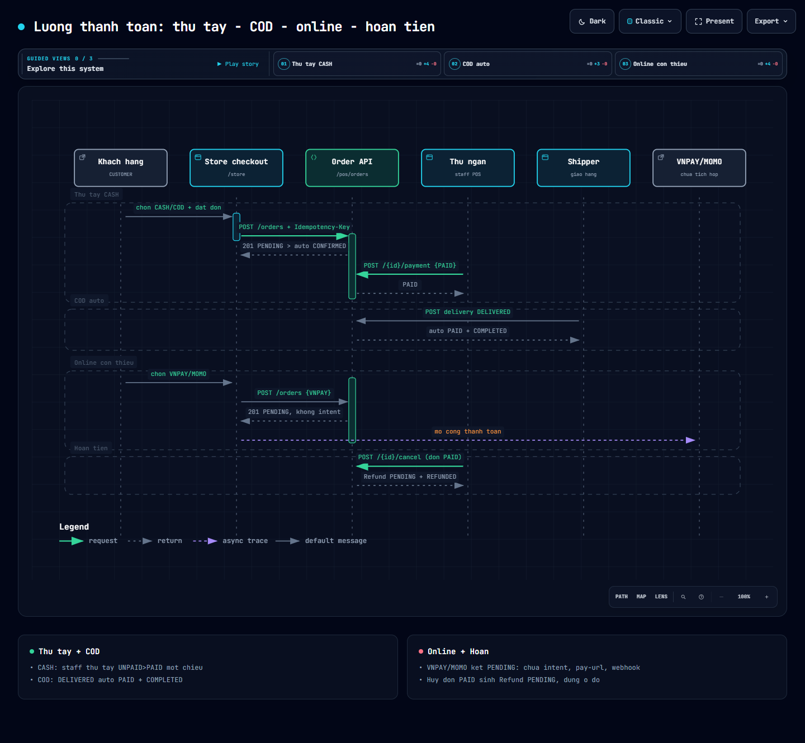

# BA-06 — Module Thanh toán (Payment): thu tiền, đối soát online, hoàn tiền

> Trạng thái: **một nửa đã triển khai** — CASH/COD chạy đủ E2E; VNPAY/MOMO/BANK_TRANSFER online và duyệt hoàn tiền chưa có code.
> Phạm vi: `paymentMethod`/`paymentStatus` trên đơn → thu tay → COD tự thu → ý định thanh toán online (`payment_intent`) → webhook → hoàn tiền (`refund`) → voucher → chốt ca/báo cáo theo kênh tiền.
> Nguồn rà soát trực tiếp từ code (không đoán): `core-model` (`domain/Order.java`, `domain/PaymentIntent.java`, `domain/Refund.java`, `domain/VoucherUsage.java`, `dto/request/pos/CreateOrderRequest.java`, `dto/request/pos/UpdatePaymentStatusRequest.java`), `backend-service` (`service/pos/PosFlow.java`, `controller/OrderController.java`, `service/impl/OrderServiceImpl.java`, `service/impl/DeliveryServiceImpl.java`, `service/impl/ShiftOperationServiceImpl.java`, `service/impl/PosReportServiceImpl.java`, `repository/RefundRepository.java`, `resources/db/changelog/changeset/007-pos.sql`, `010-permission-seed.sql`), `frontend` (`features/store/checkout/*`, `features/store/services/pos-api.service.ts`, `features/pos/pos-staff-api.service.ts`, `features/pos/order.model.ts`, `features/pos/orders/order-list.*`, `app.routes.ts`, `core/config/functions.constants.ts`).
> Sơ đồ tương tác: [`D5 — Luồng thanh toán`](diagrams/payment-sequence-cash-cod-online-refund.html) ([](diagrams/payment-sequence-cash-cod-online-refund.html)). Tổng quan E2E xem [`BA-05`](BA-05-e2e-order-ship-kds-stock.md) (mục 10 là bản tóm tắt, tài liệu này là bản đầy đủ để code).
> Bản lập: 2026-09-22.

---

## 0. Đọc nhanh cho từng vai trò

| Bạn là | Đọc mục |
|---|---|
| BA/PO muốn hiểu nghiệp vụ | 1, 3, 4, 6 |
| Dev BE code tiếp online/refund | 2, 3, 5, 7 (đặc biệt 7.1–7.6), 9 |
| Dev FE làm checkout/refund list | 2, 4.6, 5.5, 7.7, 9 |
| Tester viết test | 3, 5, 8 |

Thuật ngữ: **thu tay** = staff bấm đã thu tiền trên màn Đơn hàng; **tiền thật** = tiền đã vào tài khoản (online/webhook) — comment trong `OrderServiceImpl.java:719-722` dùng từ này để phân biệt với đơn CASH/COD được tin tưởng trước; **intent** = `payment_intent`, ý định trả online cho 1 đơn + 1 cổng.

---

## 1. Tổng quan nghiệp vụ

### 1.1. Vị trí của tiền trong vòng đời đơn

Tiền là **cửa khóa** của 2 sự kiện (code đã chốt, không được rào thêm đường vòng):

1. **Hoàn tất đơn** (`complete()` + `updateStatus→COMPLETED`): từ chối nếu chưa `PAID` — `OrderServiceImpl.java:472-473` ném `ORDER_400_UNPAID`, `complete()` lặp lại ở `:595-596`.
2. **Tự hoàn tất sau giao hàng**: chỉ khi `PAID` — `DeliveryServiceImpl.java:157-158`.

Mọi đơn sinh ra đều `UNPAID` (`OrderServiceImpl.java:287` set cứng, bất kể `paymentMethod`). Không có khái niệm trả một phần ở POS (khác công nợ NCC `UNPAID/PARTIALLY_PAID/PAID` của `AccountsPayableServiceImpl.java:55-60` — hai thế giới riêng, đừng lẫn).

### 1.2. Năm phương thức và kênh thu thực tế

`CreateOrderRequest.java:17` khóa: `CASH | COD | VNPAY | MOMO | BANK_TRANSFER` (DB check `ck_orders_payment_method`, `007-pos.sql` cho phép `NULL` nhưng DTO bắt buộc).

| Phương thức | Ai trả, khi nào | Kênh thu trong code | Trạng thái triển khai |
|---|---|---|---|
| `CASH` | Khách trả tiền mặt tại quầy (đơn PICKUP) | Staff bấm thu tay | ✅ đủ |
| `COD` | Shipper thu tiền mặt khi giao (đơn DELIVERY) | BE tự thu khi `DELIVERED` | ✅ đủ |
| `VNPAY` | Khách quét/trả online | Webhook cổng | ❌ kẹt `PENDING` (mục 6.1) |
| `MOMO` | Khách trả ví MoMo | Webhook cổng | ❌ kẹt `PENDING` |
| `BANK_TRANSFER` | Khách chuyển khoản thủ công | Staff đối soát tay rồi bấm thu | ⚠️ chạy bằng tay (không đối soát tự động) |

Checkout FE hôm nay khóa cứng `paymentMethod: isDelivery ? 'COD' : 'CASH'` (`checkout.component.ts:163`) + dòng “VNPay/MoMo sắp ra mắt” (`checkout.component.html:219`) — nên thực tế chỉ 2 dòng đầu có đơn thật.

### 1.3. Nhóm kênh tiền trong chốt ca và báo cáo (đã chạy, cần biết để khỏi vỡ số)

Chốt ca (`ShiftOperationServiceImpl.java:157-169,221-233`, lặp 2 lần cho preview và close) gom theo **chuỗi chứa**, không theo enum:

- chứa `CASH` → tiền mặt (mặc định rơi vào đây nếu không khớp gì — `else` ở `:167,231`).
- chứa `CARD/VISA/MASTER` → thẻ; chứa `TRANSFER/BANK/QR` → chuyển khoản; chứa `WALLET/MOMO/ZALO` → ví.
- **Hệ quả**: `COD` (không chứa từ khóa nào) rơi vào **tiền mặt** — đúng bản chất (shipper thu tiền mặt). `VNPAY` chứa… không khớp nhóm nào → cũng rơi vào tiền mặt (sai bản chất khi online chạy thật — xem 7.8).
- `expectedCash = initialCash + cashSales − cashPayout` (`:173,237`); tổng hợp không lọc `paymentStatus` (đơn `UNPAID` vẫn tính vào doanh thu ca — BA cần quyết có lọc `PAID` không, xem 9.4).

Báo cáo đơn (`PosReportServiceImpl.java:117-119,161-179,216-217`): cột “PT thanh toán” in nguyên `paymentMethod` (`paymentChannelOf` chỉ thay `null/blank` bằng `-`), sheet 2 gom count + amount theo đúng chuỗi đó.

---

## 2. Mô hình dữ liệu

### 2.1. Tiền trên đơn (`orders` — đã dùng thật)

`007-pos.sql`: `payment_method varchar(50)` (nullable, check 5 giá trị), `payment_status varchar(30) NOT NULL DEFAULT 'UNPAID'` (**không có check constraint** — chuẩn nằm ở `PosFlow.Payment` + `UpdatePaymentStatusRequest`). Entity `Order.java:40,43` lưu String thuần.

### 2.2. `payment_intent` — bảng chết, chờ dùng (đọc kỹ trước khi code tiếp)

DDL `007-pos.sql:236-254` + entity `PaymentIntent.java:13-102`:

| Cột | Kiểu | Ý nghĩa thiết kế |
|---|---|---|
| `order_id` | uuid NN, FK cascade | 1 đơn có nhiều intent (mỗi cổng 1 dòng) |
| `provider` | varchar(50) NN | `VNPAY` / `MOMO` (khớp `paymentMethod`) |
| `amount` | numeric(12,2) NN, ≥ 0 | Số tiền yêu cầu cổng thu (= `total_amount` lúc sinh) |
| `currency` | varchar(10) NN, default `VND` | — |
| `status` | varchar(30) NN, default `PENDING` | **Không check constraint** — tự định nghĩa ở mục 3.2 |
| `request_payload` / `response_payload` | jsonb nullable | Lưu nguyên JSON gửi/nhận cổng (phục vụ đối soát + debug) |
| `expires_at` | timestamp nullable | Hạn intent — **chưa job nào đọc** |
| unique `(order_id, provider)` | — | Mỗi đơn mỗi cổng 1 intent đang hoạt động (tái tạo pay-url = update, không insert thêm) |

Không tồn tại `PaymentIntentRepository` (grep toàn BE). Viết mới theo mẫu `RefundRepository.java:9-15`.

### 2.3. `refund` — nửa sống (tạo tự động, chưa ai xử lý)

DDL `007-pos.sql:300-324` + entity `Refund.java:13-102`: `order_id` NN (FK orders), `transaction_id` nullable **không FK** — comment ngay trong SQL xác nhận *“bảng `transaction` chưa tồn tại”*; `refund_code` unique (`RF-` + random, `refundIfPaid` dùng `CodeGenerator.random("RF-", existsByRefundCode)`); `amount` = toàn bộ `total_amount` (không hoàn một phần); `status` default `PENDING`, check cho phép `PENDING/APPROVED/PROCESSED/REJECTED`; `processed_at/processed_by` (FK account, SET NULL) — **luôn null hôm nay**.

### 2.4. `voucher_usage` — giảm giá dính với đơn, độc lập với tiền

Tạo lúc đặt đơn (`OrderServiceImpl.java:390-401`, `status=ACTIVE`, `discount` theo luật voucher và capped `≤ subtotal` ở `:272`, `total = subtotal − discount + fee` ở `:275`), hoàn khi hủy/từ chối (`restoreVoucher :704-713`: usage → `CANCELLED`, `usedCount--`). Không block hoàn tất, không trừ/hoàn theo `paymentStatus`.

### 2.5. Bảng `transaction` — chưa tồn tại nhưng quyền đã seed

`010-permission-seed.sql:313-315` đã seed `pos:transaction:create/view/update`, `functions.constants.ts` có nhóm `GIAO_DỊCH: pos:transaction:*` — nhưng không bảng, không code, không màn hình. Mọi thiết kế sổ giao dịch (mục 7.6) phải sinh bảng này trước.

---

## 3. Máy trạng thái

### 3.1. Tiền trên đơn — `PosFlow.Payment {UNPAID, PAID, REFUNDED}` (`PosFlow.java:39-43`)

```
UNPAID ──(thu tay / COD auto / webhook to-be)──► PAID ──(hủy đơn, refundIfPaid)──► REFUNDED
```

Luật đã code (`updatePaymentStatus :623-661`):

- Đổi tiền cần `pos:order:update` (**staff-only**; `CUSTOMER_ALLOWED_PERMISSIONS = {pos:order:view, pos:order:cancel}` ở `:42-45`, CUSTOMER gọi là `UNAUTHORIZED` — đây là chốt chặn số 1 của online, xem 6.2).
- Cấm đổi tiền khi đơn `COMPLETED/CANCELLED/REJECTED` (`:633-637`).
- `→ PAID` khi đã `PAID`: trả về nguyên (idempotent logic, nhưng **không** `Idempotency-Key` như lúc tạo đơn).
- `PAID → UNPAID`: ném `INVALID_REQUEST` “hãy hủy đơn để hoàn tiền” (`:647-648`).
- Set `REFUNDED` tay: ném “chỉ qua hủy đơn” (`:649-652`). `REFUNDED` chỉ hệ thống set trong `refundIfPaid`.
- Mọi lần đổi ghi `OrderStatusHistory` (old = new = status đơn, note “Thu tiền → …”) + bắn realtime `ORDER_STATUS_CHANGED`.

`PosFlow` **không có `canPaymentTransition`** (khác Order/Delivery/KDS) — luật nằm rời trong service. Dev thêm luồng tiền mới nên gom vào đây cho đồng bộ.

### 3.2. Intent online — ĐỀ XUẤT (chưa có code, chốt để code một lần đúng)

```
PENDING ──(khách mở pay-url)──► REDIRECTED ──(webhook success)──► SUCCEEDED ──► (BE set đơn PAID + CONFIRMED)
    │                                │──(webhook fail/hết hạn)──► FAILED ──(tạo lại pay-url)──► PENDING (update dòng cũ)
    └──(quá expires_at, job quét)──► EXPIRED
```

Quy tắc: mỗi `(order_id, provider)` 1 dòng (đúng unique sẵn có); tạo lại = update `amount/request_payload/expires_at` về `PENDING`, không insert; `SUCCEEDED` là trạng thái cuối (không sửa); chỉ webhook đã verify chữ ký mới được chuyển sang `SUCCEEDED/FAILED` (mọi request khác 401, không đổi gì).

### 3.3. Refund — nửa đầu đã có, nửa sau ĐỀ XUẤT

```
HIỆN TẠI:  (không) ──(hủy đơn PAID)──► PENDING ── ✕ hết
ĐỀ XUẤT :  PENDING ──(kế toán duyệt, pos:refund:update)──► APPROVED ──(chi tiền + ghi transaction)──► PROCESSED
              │──(từ chối, bắt buộc lý do)──► REJECTED
```

`PENDING` do hệ thống sinh (`refundIfPaid :780-796`: chỉ khi đơn `PAID`, chống trùng bằng `existsByOrderIdAndStatus PENDING`). `PROCESSED` set `processed_at/by` + link `transaction_id` (cần bảng mục 7.6).

---

## 4. AS-IS: từng luồng hôm nay chạy thế nào (đọc code là thấy)

### 4.1. CASH pickup — đủ E2E
1. Khách `POST /api/v1/pos/orders {paymentMethod: CASH, …}` (+ `Idempotency-Key` chống đặt trùng) → `201`, `UNPAID/PENDING` (`OrderServiceImpl.java:287`).
2. Quán mở → auto `CONFIRMED` (`isAutoConfirmable :719-722`: `CASH/COD + isOpenNow`; online “phải chờ tiền thật” nên ở lại).
3. Bếp/bar chạy KDS → `READY`.
4. Thu ngân mở Đơn hàng → nút Thu tiền (hiện khi `!CANCELLED/REJECTED/COMPLETED && paymentStatus==UNPAID`, `order-list.component.html:300-304`) → modal “Xác nhận đã thu … của đơn …?” (`:344-355`) → `POST /{id}/payment {status: PAID}` (`pos-staff-api.service.ts:83-85`, `order-list.component.ts:363-366`).
5. `READY + PAID` → Hoàn tất (`complete :592-619`).

### 4.2. COD delivery — đủ E2E, thu tự động
Như CASH đến `READY` → shipper `ASSIGNED → PICKED_UP → DELIVERING → DELIVERED`; tại `DELIVERED`, nếu `paymentMethod=COD && UNPAID` thì BE tự `PAID` (giả thiết E4, `DeliveryServiceImpl.java:150-154`: “coi như thu tiền mặt, khỏi treo đơn”), đủ `PAID` thì tự `COMPLETED` (`:156-164`). Chưa `PAID` (VD VNPAY gán nhầm COD? không — method bất biến sau tạo đơn) thì bếp vẫn dọn ticket, đơn ở lại chờ thu tay.

### 4.3. VNPAY / MOMO — kẹt (mô tả đúng để khỏi tưởng chạy)
Đơn tạo `PENDING/UNPAID` → không intent, không pay-url, không webhook → không bao giờ `PAID/CONFIRMED` → staff chỉ có thể hủy/từ chối. Muốn “mở tạm” hôm nay: staff thu tay sau khi thấy tiền về tài khoản (BANK_TRANSFER cũng vậy — đối soát thủ công ngoài hệ thống).

### 4.4. Hủy đơn dính tiền
`cancel()` (`:556-588`, CUSTOMER được hủy đơn mình + staff `pos:order:cancel`) và `updateStatus→CANCELLED` (`:517-518`) đều gọi `refundIfPaid` + `restoreVoucher`. Chỉ hủy sớm (`PENDING/CONFIRMED/PREPARING`, + `READY` hậu `FAILED` — xem BA-05 mục 2/3). Đơn `PAID` bị hủy → có `Refund PENDING` + đơn `REFUNDED`; đơn `UNPAID` bị hủy → không refund.

### 4.5. Voucher
Giảm vào `total` từ lúc tạo đơn; hủy/từ chối thì usage → `CANCELLED` và `usedCount--`. Không liên quan `paymentStatus`.

### 4.6. Màn hình và quyền hôm nay

| Màn hình | Route | Trạng thái | Thao tác tiền |
|---|---|---|---|
| Checkout (`store/checkout`) | `/store/...` (public) | Khóa `COD`/`CASH` theo hình thức giao/nhận | Tạo đơn (không thu) |
| Đơn hàng (`pos/orders/list`) | `/admin/pos/orders/list` (`pos:order:view`) | Đủ | Nút Thu tiền (`pos:order:update`), modal xác nhận |
| Giao hàng (`pos/deliveries/list`) | `pos:delivery:view` | Đủ | Gián tiếp thu COD (`pos:delivery:update`) |
| Thanh toán (`pos/payments/list`) | coming-soon (`pos:payment_intent:view`) | ❌ chưa có | — |
| Hoàn tiền (`pos/refunds/list`) | coming-soon (`pos:refund:view`) | ❌ chưa có | — |
| Đơn của tôi (`my-orders`) | CUSTOMER | Hiển thị | Đã có label đón đầu `VNPAY→VNPAY QR, MOMO→Ví MoMo, BANK_TRANSFER→Chuyển khoản, REFUNDED→Đã hoàn tiền` (`my-orders.component.ts:235-250`) |

Quyền đã seed chờ dùng (`010-permission-seed.sql:309-320`): `pos:payment_intent:create/view/update`, `pos:transaction:create/view/update`, `pos:refund:create/view/update/delete`; nhóm FE `Y_DINH_THANH_TOAN` (`pos:payment_intent:*`), `HOAN_TIEN` (`pos:refund:*`), `GIAO_DICH` (`pos:transaction:*`) trong `functions.constants.ts:90,92`.

---

## 5. Quy tắc nghiệp vụ bắt buộc (dev không được phá)

1. **Mọi đơn sinh ra `UNPAID`** (`:287`) — không có “đơn tạo ra đã thu”.
2. **`paymentMethod` bất biến sau tạo đơn** — không API đổi; đổi nghĩa là hủy tạo lại (tránh lệch đối soát cổng).
3. **Tiền một chiều** `UNPAID → PAID → (qua hủy) REFUNDED`; cấm `PAID → UNPAID` và `REFUNDED` tay (`:643-652`).
4. **Hoàn tất đòi `PAID`** (`:472-473, :595-596`) + DELIVERY đòi `delivery=DELIVERED` (`requireDeliveredForComplete :730-741`).
5. **COD auto-thu chỉ khi còn `UNPAID`** (`DeliveryServiceImpl.java:151-153`) — đã `PAID` (thu tay trước) thì giữ nguyên, không ghi đè.
6. **Refund = toàn bộ `total_amount`**, một phiếu `PENDING`/đơn (`existsByOrderIdAndStatus`), mã `RF-` unique.
7. **Tiền và kho độc lập**: thu/hoàn tiền không reserve/release tồn (tồn chỉ theo trạng thái đơn — BA-05 mục 4).
8. **Tiền và voucher độc lập**: voucher hoàn theo hủy đơn, không theo payment.
9. **Realtime + history**: mọi đổi tiền ghi history + bắn `ORDER_STATUS_CHANGED` (`:655-659`) — FE đang nghe để refresh.
10. **Báo cáo/chốt ca đọc `paymentMethod` thô** (mục 1.3) — thêm method mới phải cập nhật nhóm kênh, nếu không số rơi nhầm “tiền mặt”.

---

## 6. GAP — cái gì chưa có (checklist cho sprint)

| # | Thiếu | Bằng chứng | Sprint gợi ý |
|---|---|---|---|
| 6.1 | Webhook online (endpoint, verify chữ ký, pay-url, intent repo/service) | Không file `*Vnpay*/*Momo*/*Webhook*`; `PaymentIntent` không repository; `expires_at` không job đọc | A — online |
| 6.2 | CUSTOMER tự xác nhận tiền sau callback | `CUSTOMER_ALLOWED_PERMISSIONS` (`:42-45`) + `TODO [VNPay Sprint] Fix 3` (`:624-625`) + `TODO` checkout (`checkout.component.ts:162`) | A — online |
| 6.3 | Duyệt/chi hoàn tiền + bảng `transaction` | `processed_*/transaction_id` luôn null; không controller/service; comment SQL “bảng chưa tồn tại”; 2 màn coming-soon | B — refund |
| 6.4 | Đối soát BANK_TRANSFER tự động | Chỉ thu tay sau khi thấy tiền | C (hoặc giữ tay — quyết ở 9.5) |
| 6.5 | `canPaymentTransition` trong `PosFlow` | Luật nằm rời trong service | A (gọn, làm kèm) |
| 6.6 | Lọc `paymentStatus` trong chốt ca/báo cáo | `ShiftOperationServiceImpl` cộng cả đơn `UNPAID` | B (quyết ở 9.4) |

---

## 7. TO-BE: thiết kế để code tiếp (dev đọc mục này là code được)

Nguyên tắc chung: **không sửa hành vi CASH/COD đang chạy**; mọi cái mới đi đường mới (endpoint mới, quyền mới), reuse `refundIfPaid` và cửa `PAID` hiện tại.

### 7.1. Intent online — API đề xuất (prefix mới, không đụng `/pos/orders`)

Base `POST /api/v1/pos/payments` (controller mới `PaymentController`, service mới `PaymentService` + dùng `PosFlow.PaymentIntent` mới thêm vào `PosFlow.java`):

| Endpoint | Ai | Input → Output | Luật chính |
|---|---|---|---|
| `POST /intents {orderId, provider: VNPAY\|MOMO}` | CUSTOMER (đơn của mình, `UNPAID`, chưa `CANCELLED/REJECTED/COMPLETED`) | → `{intentId, payUrl, expiresAt}` (201; tạo lại khi còn `PENDING/FAILED/EXPIRED` thì update dòng cũ theo unique `(order_id, provider)`) | `amount` = `total_amount` hiện tại (chụp số, khóa chênh); `expires_at = now + 15 phút` (cấu hình); lưu `request_payload` |
| `GET /intents/by-order/{orderId}` | CUSTOMER (đơn mình) / staff `pos:payment_intent:view` | → intent đang hoạt động + `payUrl` (nếu còn hạn) | Hết hạn thì báo `EXPIRED`, FE gọi tạo lại |
| `POST /webhook/{provider}` | public (không JWT) + verify chữ ký cổng | payload cổng → 200 luôn (kể cả lỗi nghiệp vụ, để cổng khỏi retry vô hạn — log lỗi riêng) | Xem 7.2; chỉ chuyển `SUCCEEDED` khi verify OK + `amount` khớp + intent còn hiệu lực |
| `GET /transactions?...` | staff `pos:transaction:view` | Sổ giao dịch (mục 7.6) | Phục vụ đối soát |

Tạo `PaymentIntentRepository` (mẫu `RefundRepository`): `findByOrderIdAndProvider`, `findByOrderIdAndStatus`, `findExpiredBefore(Instant)`.

### 7.2. Verify webhook — yêu cầu bảo mật (đối chiếu sandbox trước khi code cứng)

- **VNPay**: query/IPN chứa `vnp_SecureHash`; sắp xếp param `vnp_*` (trừ hash), nối `key=value&…`, HMAC-SHA512 với `secretKey`, so sánh **constant-time**; check `vnp_ResponseCode == "00"` + `vnp_TransactionStatus == "00"`; `vnp_TxnRef` = `orderCode` (+ hậu tố chống trùng, tách khi tra đơn); `vnp_Amount` (đơn vị ×100) so bằng `intent.amount`; `vnp_PayDate` trong hạn.
- **MoMo**: JSON `partnerCode/orderId/requestId/amount/orderInfo/transId/resultCode/message/signature/extraData`; tính lại `signature` = HMAC-SHA256 chuỗi `accessKey=…&amount=…&extraData=…&ipnUrl=…&orderId=…&orderInfo=…&partnerCode=…&redirectUrl=…&requestId=…&requestType=…` (đúng thứ tự tài liệu MoMo) với `secretKey`, so sánh constant-time; chỉ `resultCode == 0` là success.
- Chung: lưu nguyên `response_payload`; verify fail → 401 + alert, **không đổi bất kỳ trạng thái nào**; success nhưng đơn đã `CANCELLED` → ghi nhận `FAILED` + tạo task soát tay (không tự hoàn vì tiền đã vào — quyết ở 9.3).

> Khóa/URL cấu hình theo môi trường (`vnp.tmn-code`, `vnp.secret`, `momo.partner-code`…), **không hardcode, không commit secret**. Tham số trên theo spec công khai của cổng — kiểm lại với tài liệu + sandbox khi code.

### 7.3. Webhook success chạy gì (1 transaction, đúng thứ tự)

1. Lock intent (`PESSIMISTIC_WRITE`) + lock đơn; bỏ qua nếu intent đã `SUCCEEDED` (cổng retry) — trả 200.
2. Đối chiếu `amount`; lệch → `FAILED` + alert, 200.
3. Intent → `SUCCEEDED` (+ `response_payload`).
4. Đơn `UNPAID → PAID` (reuse đúng luật `updatePaymentStatus`, nhưng gọi nội bộ — không qua check `pos:order:update` của staff).
5. Nếu đơn còn `PENDING` và `paymentMethod` online → `CONFIRMED` (đi tiếp luồng trừ kho + KDS như auto-confirm CASH: reuse `isAutoConfirmable`-style branch — tách hàm chung, đừng copy).
6. Ghi history + realtime (giữ nguyên format `writeHistory/publishRealtimeEvent`).
7. Sinh `transaction` `CAPTURE` (mục 7.6) để đối soát.

### 7.4. Mở quyền cho CUSTOMER (Fix 3 trong TODO) — thiết kế `requirePaymentPermission`

Thay `requirePermission("pos:order:update")` trong `updatePaymentStatus` bằng:

- Nguồn gốc nội bộ (webhook/service gọi nhau): bypass có kiểm soát (không qua HTTP hoặc secret nội bộ) — không mở HTTP cho CUSTOMER ở endpoint này.
- CUSTOMER qua HTTP: **từ chối mọi `status` do client gửi** (giữ nguyên chặn hôm nay) — CUSTOMER chỉ được *xem* intent (7.1) và *mở* pay-url; tiền chỉ đổi qua webhook đã verify. Như vậy khỏi mở endpoint nguy hiểm mà online vẫn chạy khép kín.

### 7.5. Expiry job

Scheduler mỗi 5 phút: intent `PENDING/REDIRECTED` quá `expires_at` → `EXPIRED` (dùng index `idx_payment_intent_status_created` sẵn có). FE `my-orders` thấy `EXPIRED` thì hiện “Tạo lại link thanh toán”. Cân nhắc hủy đơn `PENDING` quá hạn lâu (VD 24h, đơn online chưa trả) — quyết ở 9.2.

### 7.6. Sổ giao dịch `transaction` (cần cho đối soát + hoàn tiền)

Changeset mới (tên gợi ý `020-payment-transaction.sql`): `id, order_id FK, intent_id FK nullable, refund_id FK nullable, kind CHECK (CAPTURE/REFUND_PAYOUT/ADJUSTMENT), provider, amount ≥ 0, currency default VND, status CHECK (PENDING/SUCCEEDED/FAILED), provider_ref, payload jsonb, created_*`. Mọi đổi tiền (thu tay, COD auto, webhook, chi hoàn) đều ghi 1 dòng — báo cáo/chốt ca về sau đọc từ đây thay vì đoán chuỗi `paymentMethod`.

### 7.7. Refund đủ vòng (sprint B)

API trên `/api/v1/pos/refunds` (controller + service mới, reuse `RefundRepository` + thêm `findByStatus` phân trang):
`GET /?status&search` (`pos:refund:view`) → `POST /{id}/approve {note?}` (`pos:refund:update`, người duyệt ≠ người tạo đơn nếu có thể, `PENDING → APPROVED`) → `POST /{id}/process {providerRef?}` (đã chi tiền thật ngoài hệ thống / qua API cổng nếu có, `APPROVED → PROCESSED`, set `processed_at/by`, sinh `transaction REFUND_PAYOUT`, link `transaction_id`) → `POST /{id}/reject {reason*}` (`PENDING → REJECTED`, bắt buộc lý do). Đơn đã `REFUNDED` giữ nguyên (không revert về `PAID` khi từ chối — tiền chưa ra khỏi quán thì mở endpoint điều chỉnh tay có audit; quyết ở 9.3).
FE: thay 2 màn coming-soon bằng list thật (`pos/payments/list` đọc intents + transactions; `pos/refunds/list` duyệt/chi/từ chối), dùng nhóm quyền đã seed (`Y_DINH_THANH_TOAN`, `HOAN_TIEN`, `GIAO_DICH`).

### 7.8. Sửa nhóm kênh tiền (khi online chạy)

`ShiftOperationServiceImpl` + strany sau (giữ fallback tiền mặt cho chuỗi lạ): `VNPAY/QR` → chuyển khoản? Không — VNPay QR là ví/ngân hàng; quyết: thêm nhánh `VNPAY → ewallet? hay bankTransfer?` — tốt nhất gom theo **provider của intent/transaction** thay vì đoán chuỗi (lý do làm 7.6 trước). Tối thiểu: thêm `VNPAY` vào nhóm ví hoặc nhóm riêng `onlineSales` trong `ClosingSummaryResponse` (thêm field = đổi DTO + FE chốt ca — liệt kê vào task).

---

## 8. Test chấp nhận (viết test theo bảng này là đủ)

| # | Kịch bản | Kỳ vọng |
|---|---|---|
| T1 | Tạo đơn CASH, quán mở | Auto `CONFIRMED`, `UNPAID` |
| T2 | Thu tay `PAID` rồi thu nữa | 200, giữ `PAID` (idempotent) |
| T3 | Set `PAID → UNPAID` / set `REFUNDED` tay | 400 `INVALID_REQUEST` đúng message |
| T4 | Đổi tiền khi đơn `COMPLETED/CANCELLED/REJECTED` | 400 `ORDER_400_INVALID_STATUS_TRANSITION` |
| T5 | CUSTOMER gọi `POST /{id}/payment` | 401/403 (chưa tới Fix 3 thì vẫn chặn) |
| T6 | COD + `DELIVERED` | Auto `PAID` + `COMPLETED`; thu tay trước thì không ghi đè |
| T7 | Tạo đơn VNPAY | `PENDING/UNPAID`, chưa intent nào (as-is) |
| T8 | Hủy đơn `PAID` 2 lần liên tiếp | 1 refund `PENDING`, đơn `REFUNDED`, không trùng |
| T9 | Hủy đơn `UNPAID` | Không sinh refund |
| T10 | (to-be) Webhook sai chữ ký | 401, không đổi gì, có alert/log |
| T11 | (to-be) Webhook success gửi 2 lần | 1 lần đổi tiền, lần 2 200 bỏ qua |
| T12 | (to-be) Webhook amount lệch | Intent `FAILED`, đơn giữ `UNPAID`, alert |
| T13 | (to-be) Intent hết hạn | Job set `EXPIRED`; FE tạo lại được pay-url mới |
| T14 | (to-be) Duyệt refund 2 cấp | `PENDING → APPROVED → PROCESSED`, có `transaction REFUND_PAYOUT` |
| T15 | Chốt ca có đơn COD + CASH | COD cộng vào `cashSales` (hành vi hiện tại, khóa lại bằng test) |

---

## 9. Quyết định còn mở (PO chốt trước sprint)

1. **BANK_TRANSFER** tự động (sinh QR + đối soát sao kê) hay giữ thu tay? (giữ tay = 0 code, chỉ cần HDV đối soát).
2. Có tự hủy đơn online `PENDING` quá hạn (VD 24h) để giải phóng tồn? (tồn đã reserve lúc `CONFIRMED` — đơn online kẹt `PENDING` chưa reserve nên chỉ rối list).
3. Webhook success nhưng đơn đã bị hủy trước đó: tự hoàn qua cổng hay task soát tay?
4. Chốt ca/báo cáo có lọc `paymentStatus = PAID` không? (hôm nay cộng cả `UNPAID`).
5. Thêm phương thức mới (CARD quẹt, ZALO…) = thêm enum ở 3 nơi (`CreateOrderRequest`, `ck_orders_payment_method`, nhóm kênh chốt ca) — ai được thêm?
6. Refund có cho hoàn một phần không? (hôm nay luôn full `total_amount`).

---

## Phụ lục A. Tham chiếu code nhanh (mở file là thấy)

| Việc | File |
|---|---|
| Enum tiền + luật đơn/giao/bếp | `backend-service/.../service/pos/PosFlow.java:18-51,93-127,145-155` |
| Tạo đơn: `UNPAID` cứng, auto-confirm CASH/COD | `service/impl/OrderServiceImpl.java:286-287,376,719-722` |
| Thu tay 1 chiều + chặn CUSTOMER (TODO Fix 3) | `service/impl/OrderServiceImpl.java:623-661,42-45` |
| Cửa hoàn tất đòi `PAID` | `service/impl/OrderServiceImpl.java:472-473,594-596` |
| Hủy sinh refund + hoàn voucher | `service/impl/OrderServiceImpl.java:517-518,580-581,704-713,780-796` |
| COD auto-thu + tự hoàn tất | `service/impl/DeliveryServiceImpl.java:148-169` |
| API payment duy nhất | `controller/OrderController.java:68-73` (`POST /api/v1/pos/orders/{id}/payment`) |
| Entity intent/refund, DTO | `core-model/.../domain/PaymentIntent.java`, `domain/Refund.java`, `dto/request/pos/CreateOrderRequest.java:17`, `dto/request/pos/UpdatePaymentStatusRequest.java` |
| Repo refund | `backend-service/.../repository/RefundRepository.java` (chưa có `PaymentIntentRepository`) |
| DDL intent/refund/orders/voucher | `resources/db/changelog/changeset/007-pos.sql` (orders ~79-121, intent 236-254, refund 300-324) |
| Quyền payment/refund/transaction đã seed | `resources/db/changelog/changeset/010-permission-seed.sql:309-320` |
| Chốt ca gom kênh tiền | `service/impl/ShiftOperationServiceImpl.java:157-169,221-233` |
| Báo cáo đơn + breakdown kênh | `service/impl/PosReportServiceImpl.java:117-119,161-179,216-217` |
| FE checkout khóa CASH/COD (TODO VNPay) | `frontend/.../store/checkout/checkout.component.ts:161-163`, `checkout.component.html:218-219` |
| FE nút Thu tiền + modal | `frontend/.../pos/orders/order-list.component.ts:346-370`, `.html:300-355`, api `pos-staff-api.service.ts:83-85` |
| FE payments/refunds coming-soon + nhóm quyền | `frontend/.../app.routes.ts:197-209`, `core/config/functions.constants.ts:90,92` |
| FE label đón đầu VNPAY/MOMO/BANK_TRANSFER/REFUNDED | `frontend/.../my-orders.component.ts:235-250` |
